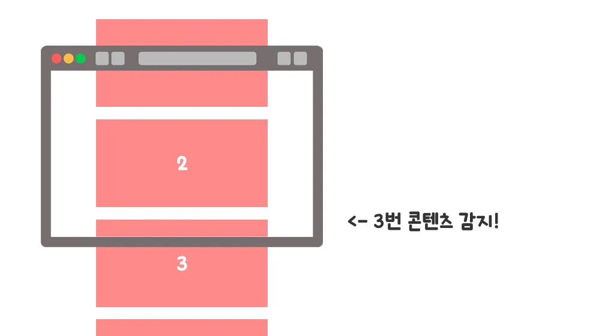
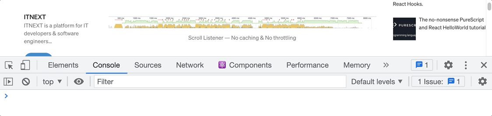

# 무한 스크롤이란?

무한 스크롤(Infinite Scroll)은 단어 그대로 스크롤을 무한으로 할 수 있는 기능을 말하며, 페이지의 최하단에 도달했을 때 신규 콘텐츠를 로드하는 식으로 동작합니다. 페이지네이션(Pagination)과 동일하게 많은 콘텐츠를 사용자에게 제공하는 기술 중 하나로서, 무엇이 더 낫다라기 보다는 각자의 고유한 특징과 서로 상호보완적인 부분이 명확하게 존재하기 때문에, 만들고자 하는 애플리케이션의 성격에 맞게 결정하면 됩니다.

이번에는 무한 스크롤을 만들어 보는 시간이니, 무한 스크롤에 대한 장단점만 살펴보겠습니다.

### 무한 스크롤의 장점

- 콘텐츠 탐색이 간단하며, 별도의 추가 동작(페이지 버튼 클릭 등)이 필요 없습니다.
- 모바일 환경(터치 스크린) 또는 세로로 긴 화면을 보유한 디바이스에서 강점을 갖습니다.

### 무한 스크롤의 단점

- 한 페이지 내에 많은 콘텐츠가 로드 되므로, 페이지 성능이 느려집니다.
- 많은 컨텐츠 로드 후, 눈여겨봤던 콘텐츠로 다시 돌아가기 어렵습니다.
- 사이트 하단(Footer)을 찾기 어려워집니다.

페이지네이션의 장단점은 추후 페이지네이션을 구현해 보는 내용을 다룰 때 살펴보도록 하겠습니다!


> 오늘은 개인적으로 좋아하는 걸그룹 에스파의 윈터로 예제를 준비했습니다.

# 무한 스크롤 구현하기

## Intersection Observer API

여기서는 Web API 중 하나인 `Intersection Observer`를 사용해 무한 스크롤을 구현해 볼 생각입니다. `Intersection Observer`는 기본적으로 관찰 중인 요소(Element)가 뷰포트(Viewport)와 교차하고 있는지를 감지하는 API인데, 좀 더 쉽게 설명하자면 관찰 중인 요소가 사용자가 보는 화면 영역 내에 들어왔는지를 알려주는 API입니다.



사용 방법은 간단합니다. 먼저 `new IntersectionObserver(callback, options)`로 관찰자 객체를 생성한 후, 관찰 대상을 지정하여 관찰을 시작하면 됩니다. 관찰자 객체를 생성할 때 옵션은 필수가 아니지만, 다음 세 가지 옵션을 설정 가능합니다.

- **root**: 관찰 대상이 화면에 들어왔음을 감지하는 영역이며, 기본값은 `null`입니다. 이는 곧 뷰포트를 의미합니다.
- **rootMargin**: 관찰 대상을 감지하는 영역을 바깥 범위(Margin)까지 확장합니다. 기본값은 상우하좌 순으로 `"0px 0px 0px 0px"`이며, 옵션값을 지정할 때는 문자열로 단위와 함께 작성해야 합니다.
- **threshold**: 관찰 대상이 화면 내에 얼마나 들어 왔을 때 콜백 함수를 호출할 지 결정하는 값으로써 기본값은 `0(=0%)`입니다. 최대 `1(100%)`까지 지정 가능하며, 0.6이라 하면 대상이 화면에 60% 이상 보이기 시작할 때 콜백 함수를 호출합니다.

관찰 대상이 화면 내에 70% 이상 들어 왔을 때 콜백 함수를 호출하고 싶다면 이렇게 작성하면 됩니다.

```javascript
const io = new IntersectionObserver(콜백함수, { threshold: 0.7 });
io.observe(감지/관찰할 요소);
```

옵션과 함께 전달인자로 작성하는 콜백 함수는 `entries`와 `io`를 매개변수로 갖습니다. `entries`는 관찰 중인 모든 대상을 담은 배열이며, 요소 각각을 참조하기 위해서는 `forEach`를 이용해 개별적으로 접근해야 합니다. 그리고 `io`는 관찰하고 있는 관찰자 객체입니다.

```javascript
const callback = (entries, io) => {
  entries.forEach((entry) => {
    // 화면 안에 요소가 들어왔는지 체크
    if (entry.isIntersecting) {
      // 기존 관찰하던 요소는 더 이상 관찰하지 않음
      io.unobserve(entry.target);
      // TODO: 새로운 컨텐츠 추가
      // TODO: 새로운 컨텐츠의 마지막 요소를 관찰 시작
    }
  });
};
```

`entry` 객체는 관찰 중인 요소 각각에 대한 관찰 정보를 담고 있으며, 해당 요소가 화면 내에 감지되었는지, 그렇다면 어느 좌표에 위치하고 있는지 등을 확인할 수 있습니다. 이 외에도 `entry` 객체는 많은 정보를 갖고 있으니 직접 출력해 보면서 값을 확인해 보기 바랍니다.

> 본문은 무한 스크롤 구현을 소개하는 글이므로 `Intersection Observer`에 대해서는 자세히 다루지 않습니다. [MDN 문서](https://developer.mozilla.org/en-US/docs/Web/API/Intersection_Observer_API)를 포함해 정리가 잘 되어 있는 블로그가 많기 때문에 궁금한 분들은 따로 확인해 보시면 좋을 것 같습니다.

## Scroll 이벤트로도 처리할 수 있지 않을까?

대답은 Yes입니다! `Intersection Observer`가 나오기 이전에는 `window` 객체에 스크롤 이벤트를 연결하여 특정 지점까지 스크롤되었을 때, 다음 콘텐츠를 불러오는 식으로 무한 스크롤을 구현했습니다. 하지만 스크롤을 진행하는 순간마다 이벤트가 호출되어 메인 스레드 성능에 좋지 않았고, `쓰로틀(Throttle)`과 같은 최적화 작업이 늘 동반되어야 했습니다.



최적화를 하지 않았다면, 위 그림처럼 스크롤할 때마다 이벤트가 계속해서 발생했을 겁니다. 하지만 스크롤 이벤트와 달리 `Intersection Observer`는 메인 스레드와 별개로 비동기적으로 실행되기 때문에, 별도의 최적화가 없더라도 기본적으로 훨씬 빠른 퍼포먼스를 보여 줍니다.

## Skeleton UI

유튜브를 접속해 보면 로딩 중임을 알려주는 회색조의 애니메이션 요소를 본 적이 있을 거예요. 이를 스켈레톤 UI라 부르는데, 사용자들에게 데이터가 로드되고 있음을 알려줍니다. 스켈레톤 요소는 실제 로드될 콘텐츠와 유사한 모양으로 배치되기 때문에, 사용자에게 해당 위치에 어떤 데이터가 불러와질 것인지 예측 가능하게 하여 응답성이 더 빠르게끔 느낄 수 있게 합니다.

이런 장점이 있어 화면에 로딩 스피너를 띄우는 대신 스켈레톤 요소를 그리는 것이 무조건 좋다 생각할 수 있지만, 스켈레톤을 만들 때 들어가는 비용(CSS 애니메이션 또는 이미지)도 있기 때문에 만들고자 할 때 잘 고려해야 합니다.

## 예제로 준비한 HTML/CSS 코드

반응형은 크게 고려하지 않고, 한 줄에 4개의 카드가 나타나도록 간단하게 디자인했습니다.


### HTML 코드

```html title="index.html"
<!doctype html>
<html lang="ko">
  <head>
    <meta charset="UTF-8" />
    <title>Infinite Scroll</title>
    <!-- Styles -->
    <link rel="stylesheet" href="style.css" />
  </head>
  <body>
    <ul class="card-list">
      <li class="card">
        
        <p class="card__text">Aespa :: Winter 1</p>
      </li>
      <li class="card">
        
        <p class="card__text">Aespa :: Winter 2</p>
      </li>
      <li class="card">
        
        <p class="card__text">Aespa :: Winter 3</p>
      </li>
      <li class="card">
        
        <p class="card__text">Aespa :: Winter 4</p>
      </li>
      <li class="card">
        
        <p class="card__text">Aespa :: Winter 5</p>
      </li>
      <li class="card">
        
        <p class="card__text">Aespa :: Winter 6</p>
      </li>
      <li class="card">
        
        <p class="card__text">Aespa :: Winter 7</p>
      </li>
      <li class="card">
        
        <p class="card__text">Aespa :: Winter 8</p>
      </li>
    </ul>
    <!-- Scripts -->
    <script src="app.js"></script>
  </body>
</html>
```

### CSS 코드

```css title="style.css"
* {
  margin: 0;
  padding: 0;
  box-sizing: border-box;
}

.card-list {
  width: 100%;
  height: 500px;
  padding: 0.5rem;
  overflow-y: scroll;
  background: bisque;
}

.card,
.skeleton {
  width: 25%;
  padding: 0.5rem;
  float: left;
  list-style: none;
}

.card__image {
  display: block;
  width: 100%;
  height: 300px;
  object-fit: cover;
}

.card__text,
.skeleton__text {
  height: 40px;
  text-align: center;
  line-height: 40px;
  background: #fff;
  font-size: 0.9rem;
}

.skeleton__image {
  width: 100%;
  height: 300px;
  animation: skeleton-gradient 3s linear infinite;
}

@keyframes skeleton-gradient {
  0% {
    background: rgb(212, 212, 212);
  }
  50% {
    background: rgb(128, 128, 128);
  }
  100% {
    background: rgb(212, 212, 212);
  }
}

.spinner {
  margin: 0 auto;
  display: block;
  width: 150px;
}
```

## 자바스크립트 로직 작성

### 필요한 변수 선언 & 함수 정의

우리는 스크롤이 사이트 하단에 도달했을 때 스켈레톤 UI와 로딩 스피너를 띄워야 하기 때문에, 미리 생성해서 변수에 담아 둡니다. 무한 스크롤을 통해 매 순간 8장의 신규 이미지를 로드할 것이기에, 그 자리를 잠시 동안 대신할 수 있는 8개의 스켈레톤 요소를 생성합니다. 저는 조금이라도 재사용할 만한 부분이 있으면 함수로 만드는 편이라, 스켈레톤 요소와 스피너 요소를 생성하는 함수를 추가로 구현했습니다.

```javascript title="app.js"
const makeSpinner = () => {
  const spinner = document.createElement('div');
  const spinnerImage = document.createElement('img');
  spinner.classList.add('loading');
  spinnerImage.setAttribute('src', 'images/spinner.gif');
  spinnerImage.classList.add('spinner');
  spinner.appendChild(spinnerImage);
  return spinner;
};

const makeSkeleton = () => {
  const skeleton = document.createElement('li');
  const skeletonImage = document.createElement('div');
  const skeletonText = document.createElement('p');
  skeleton.classList.add('skeleton');
  skeletonImage.classList.add('skeleton**image');
  skeletonText.classList.add('skeleton**text');
  skeletonText.textContent = ' ';
  skeleton.appendChild(skeletonImage);
  skeleton.appendChild(skeletonText);
  return skeleton;
};

const list = document.querySelector('.card-list');
const items = document.querySelectorAll('.card');
const skeletonItems = Array.from({ length: items.length }, () => makeSkeleton());
const spinner = makeSpinner();
```

4개의 변수는 각각 다음의 요소들을 담고 있습니다.

- **list**: 이후 새로운 요소를 추가할 때 사용될 부모 요소입니다.
- **items**: 현재 화면에 출력되고 있는 카드 아이템들을 담은 배열입니다. (최초 8개의 아이템)
- **skeletonItems**: 8개의 스켈레톤 요소를 담고 있는 배열입니다.
- **spinner**: 신규 콘텐츠 로드 중 스켈레톤 UI와 함께 출력할 스피너 요소입니다.

### 로딩 관련 기능 구현

새로운 콘텐츠를 불러오는 로딩 작업이 시작되면 스켈레톤 UI와 스피너를 화면에 보이고, 로딩이 종료되면 해당 요소들을 화면에서 제거합니다. 이렇게 로딩과 관련된 기능들도 각각 함수로 구현했습니다. 그리고 로딩이 종료되면서 추가될 새로운 콘텐츠는 `addNewContent` 함수에서 처리하는데, 데이터를 별도로 받아 오는 API가 없기 때문에 최초에 사용되는 8장의 이미지를 복사해서 재사용했습니다.

```javascript title="app.js"
const addSkeleton = () => {
  skeletonItems.forEach((item) => list.appendChild(item));
};

const removeSkeleton = () => {
  skeletonItems.forEach((item) => list.removeChild(item));
};

const loadingStart = () => {
  addSkeleton();
  list.appendChild(spinner);
};

const loadingFinish = () => {
  removeSkeleton();
  list.removeChild(spinner);
};

const addNewContent = () => {
  items.forEach((item) => list.appendChild(item.cloneNode(true)));
};
```

만약 백엔드와의 통신을 통해 데이터를 받아올 수 있다면, 비동기 문법을 사용해서 데이터를 받은 후 띄우는 식으로 처리하면 됩니다.

### Intersection Observer 연결

`Intersection Observer` 객체를 만든 후에는 관찰(observe)할 요소를 결정해야 하는데, 어차피 사이트 최하단에는 마지막 아이템 요소가 있을 것이기에, 이에 대해서만 관찰하도록 처리했습니다. 그리고 신규 콘텐츠가 로드된 이후에는 기존에 관찰하던 요소를 더 이상 관찰하지 않도록 취소(unobserve)하고, 새로 추가된 마지막 요소를 관찰 시작해야 합니다.

이 과정은 계속해서 반복되기 때문에 `observeLastItem`이라는 함수를 추가로 구현했습니다.

```javascript
const ioCallback = (entries, io) => {
  entries.forEach((entry) => {
    if (entry.isIntersecting) {
      io.unobserve(entry.target);
      loadingStart();
      setTimeout(() => {
        addNewContent();
        loadingFinish();
        observeLastItem(io, document.querySelectorAll('.card'));
      }, 2000);
    }
  });
};

const observeLastItem = (io, items) => {
  const lastItem = items[items.length - 1];
  io.observe(lastItem);
};

const io = new IntersectionObserver(ioCallback, { threshold: 0.7 });
observeLastItem(io, items);
```

콜백 함수 뒷 부분에 `setTimeout` 함수가 보이는데, 이는 비동기 통신을 최대한 따라 하기 위해 사용했습니다.

## 구현 결과

이렇게 길지 않은 코드로 간단하게 스켈레톤 UI를 적용한 무한 스크롤을 구현해 봤습니다.


# 참고 자료

- [Intersection Observer API - MDN 문서](#)
- [무한 스크롤(Infinite scroll) 구현하기](#)
- [PureCSS로 Skeleton UI 제작하기](#)
- [더 나은 UX를 위한 React에서 스켈레톤 컴포넌트 만들기](#)
