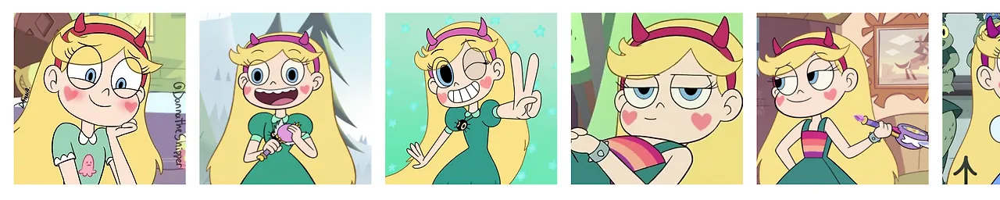
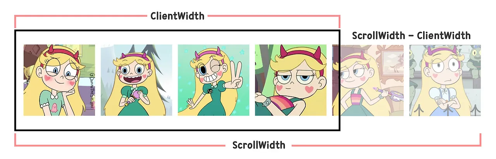
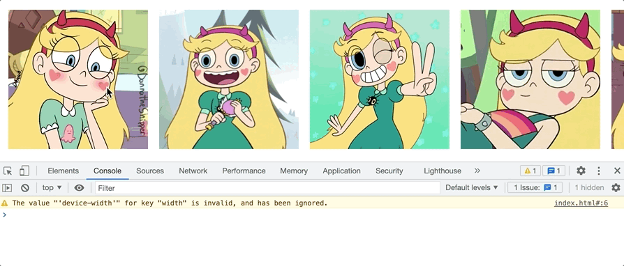

# 터치 스크롤 UI

모바일에서는 좌우로 스크롤 가능한 요소를 터치 제스처를 통해 움직이면서 읽을 수 있습니다. 이를 데스크톱 환경에서도 마우스를 가지고 동일하게 동작할 수 있도록 만들 수 있는데, 웨이브나 넷플릭스 등의 OTT나 카카오 이모티콘샵과 같은 서비스의 웹사이트를 방문해 보면 이 기능이 어떤 것인지 확인할 수 있습니다.


모바일에서는 터치를 이용한 스크롤이 기본적으로 가능하지만, 데스크톱에서는 터치 행위 자체가 불가능하기 때문에 `Mouse`, `Touch`, `Click` 이벤트에 대한 기능을 직접 구현해야 합니다. 처음에는 어디서부터 만들면 좋을지 많이 헤맸지만, 천천히 만들고 나서 보니 결과적으로 크게 어렵지는 않았기에 본문을 통해 소개하려 합니다.

> 디자인과 관련된 HTML/CSS는 자유롭게 작성하셔도 됩니다만, 예제 코드의 올바른 동작을 위해 터치 스크롤을 적용할 리스트 요소를 `flex` 등을 활용해 수평으로 만든 다음 진행해 주세요!

# 터치 스크롤 구현하기

## 예제로 준비한 HTML/CSS 코드

### HTML 코드

```html title="index.html"
<!doctype html>
<html lang="ko">
  <head>
    <meta charset="UTF-8" />
    <title>Touch Scroll</title>
    <!-- Styles -->
    <link rel="stylesheet" href="style.css" />
  </head>
  <body>
    <ul class="list">
      <li class="item">
        <a class="link" href="#">
          
        </a>
      </li>
      <li class="item">
        <a class="link" href="#">
          
        </a>
      </li>
      <li class="item">
        <a class="link" href="#">
          
        </a>
      </li>
      <li class="item">
        <a class="link" href="#">
          
        </a>
      </li>
      <li class="item">
        <a class="link" href="#">
          
        </a>
      </li>
      <li class="item">
        <a class="link" href="#">
          
        </a>
      </li>
    </ul>
    <!-- Scripts -->
    <script src="app.js"></script>
  </body>
</html>
```

### CSS 코드

```css title="style.css"
* {
  margin: 0;
  padding: 0;
  box-sizing: border-box;
}

body {
  width: 100%;
  padding: 4rem 0;
  overflow: hidden;
}

.list {
  padding: 1rem 0;
  width: 100%;
  display: flex;
  transform: translate(0, 0);
}

.item {
  padding-right: 1rem;
  list-style: none;
  user-select: none;
}

.item:first-child {
  padding-left: 1rem;
}

.link {
  display: block;
  -webkit-user-drag: none;
}

.image {
  display: block;
  width: 200px;
  height: 200px;
  -webkit-user-drag: none;
}
```

### 마크업 결과



> 최근 재밌게 본 애니메이션 별나비의 주인공인 Star를 이번 예제의 메인 소재로 사용했습니다!

## 자바크스립트 로직 작성

### 필요한 변수 선언

예제에서 사용할 변수는 그렇게 많지 않습니다.

```javascript title="app.js"
// 리스트 요소 & 가로 길이
const list = document.querySelector('.list');
const listScrollWidth = list.scrollWidth;
const listClientWidth = list.clientWidth;

// 이벤트마다 갱신될 값
let startX = 0;
let nowX = 0;
let endX = 0;
let listX = 0;
```

리스트에 대한 참조 외에 `scrollWidth`와 `clientWidth`도 함께 구한 이유는 리스트를 css의 `translate` 속성을 이용해 좌우로 움직이기 위함입니다. `clientWidth`는 가려진 영역을 제외한 현재 화면에 보이는 요소에 대한 가로 사이즈이고, `scrollWidth`는 스크롤로 인해 가려진 영역의 콘텐츠들도 모두 포함한 총 가로 사이즈입니다. 그렇기 때문에 여기서 `scrollWidth - clientWidth`로 구한 값은 리스트를 가로로 이동시킬 수 있는 최대치라 볼 수 있습니다.



### 이벤트 핸들러 선언

간단한 터치 스크롤을 구현할 때는 다음 4가지의 이벤트에 대해서만 처리하면 됩니다.

```javascript title="app.js"
const onScrollStart = (e) => {};
const onScrollMove = (e) => {};
const onScrollEnd = (e) => {};
const onClick = (e) => {};
```

### 유틸 함수 정의

여러 부분에서 재사용되는 코드는 유틸 함수로 만들어 간편하게 사용할 수 있도록 했습니다.

```javascript title="app.js"
const getClientX = (e) => {
  const isTouches = e.touches ? true : false;
  return isTouches ? e.touches[0].clientX : e.clientX;
};

const getTranslateX = () => {
  return parseInt(getComputedStyle(list).transform.split(/[^\-0-9]+/g)[5]);
};

const setTranslateX = (x) => {
  list.style.transform = `translateX(${x}px)`;
};
```

- **getClientX**: 마우스로 클릭한 지점의 X좌표는 `e.clientX`를 참조해 얻을 수 있지만, 터치 이벤트의 경우에는 `e.touches[0].clientX`를 참조해야 합니다. 두 이벤트는 동일하게 처리되어야 하므로, 하나의 함수로 묶어 둘 중 어떤 이벤트가 발생하더라도 원하는 값을 얻을 수 있도록 했습니다.
- **getTranslateX**:
  최초 스크롤은 상관없지만, 두 번째 스크롤부터는 스크롤이 종료된 위치도 고려하여 계산해야 하기 때문에 요소가 이동한 후의 X좌표(`translateX`)를 가져와야 합니다. `window` 객체에 내장된 API인 `getComputedStyle` 메서드를 사용하면 요소가 가진 CSS의 속성 값을 얻을 수 있는데, `transform`의 경우 x, y, z의 값을 모두 반환하므로 정규표현식을 통해 필요한 x의 값만 얻도록 했습니다.
- **setTranslateX**: 리스트가 스크롤 됨에 따라 X좌표를 조정하기 위해 만든 함수입니다.

### 이벤트 연결

웹사이트가 로드 될 때는 클릭과 관련된 이벤트만 먼저 연결합니다.

```javascript title="app.js"
const bindEvents = () => {
  list.addEventListener('mousedown', onScrollStart);
  list.addEventListener('touchstart', onScrollStart);
  list.addEventListener('click', onClick);
};
bindEvents();
```

### 스크롤 시작 이벤트 구현

스크롤을 시작하게 되면 마우스 또는 터치한 지점을 `startX` 변수에 저장하고, 나머지 이벤트를 마저 등록합니다.

```javascript title="app.js"
const onScrollStart = (e) => {
  startX = getClientX(e);
  window.addEventListener('mousemove', onScrollMove);
  window.addEventListener('touchmove', onScrollMove);
  window.addEventListener('mouseup', onScrollEnd);
  window.addEventListener('touchend', onScrollEnd);
};
```



### 스크롤 진행 이벤트 구현

스크롤 중에도 계속해서 현재 마우스 포인터가 위치하는 지점에 대한 X좌표를 `nowX` 변수에 저장하면서, 시작 지점이 저장된 `startX`와의 값의 차를 리스트 요소의 `translateX` 속성 값으로 사용합니다. CSS 기본 동작으로 `translateX`의 값이 양수라면 오른쪽으로, 음수라면 왼쪽으로 이동하는 것에 유의해야 합니다.

```javascript title="app.js"
const onScrollMove = (e) => {
  nowX = getClientX(e);
  setTranslateX(listX + nowX - startX);
};
```

`listX` 변수는 리스트 요소를 최초 스크롤 할 때는 필요 없지만, 두 번째로 움직일 때부터는 필요합니다. `listX` 변수에는 요소의 `translateX` 값이 저장되어 있으며, 스크롤 종료 이벤트 함수 안에서 할당합니다. 만약 이 값을 함께 계산하지 않는다면, 요소는 매 순간 최초 위치인 `tarnslateX: 0px`에서 시작될 것입니다.


마우스를 떼더라도 스크롤 동작이 이어질 텐데, 이는 스크롤 종료 이벤트를 구현하면서 처리하면 됩니다.

### 스크롤 종료 이벤트 구현

스크롤 종료를 담당하는 `onScrollEnd` 이벤트 핸들러에서는 리스트 요소가 정해진 범위를 벗어나면 보정해 주고, 모든 이벤트를 제거하는 역할을 수행합니다. 범위를 벗어나면 유효 범위로 자연스럽게 돌아올 수 있도록 애니메이션도 부여했습니다. 그리고 애니메이션이 300ms 동안 지속되기 때문에, 제거한 이벤트를 `setTimeout` 함수로 300ms 이후 다시 바인딩했습니다.

```javascript title="app.js"
const onScrollEnd = (e) => {
  endX = getClientX(e);
  listX = getTranslateX();
  if (listX > 0) {
    setTranslateX(0);
    list.style.transition = `all 0.3s ease`;
    listX = 0;
  } else if (listX < listClientWidth - listScrollWidth) {
    setTranslateX(listClientWidth - listScrollWidth);
    list.style.transition = `all 0.3s ease`;
    listX = listClientWidth - listScrollWidth;
  }

  window.removeEventListener('mousedown', onScrollStart);
  window.removeEventListener('touchstart', onScrollStart);
  window.removeEventListener('mousemove', onScrollMove);
  window.removeEventListener('touchmove', onScrollMove);
  window.removeEventListener('mouseup', onScrollEnd);
  window.removeEventListener('touchend', onScrollEnd);
  window.removeEventListener('click', onClick);

  setTimeout(() => {
    bindEvents();
    list.style.transition = '';
  }, 300);
};
```

여기까지 구현하면 기능적인 구현은 끝이기에, 결과물은 최종 결과에서 확인하시면 됩니다.

### 클릭 이벤트 구현

마우스나 터치 이벤트가 발생한 후에는 클릭 이벤트가 추가로 발생합니다. 그렇기 때문에 스크롤링을 하지 않은 경우에만 클릭 이벤트가 발생하도록 처리해야 합니다. 저는 스크롤을 하지 않은 경우에만, 이미지에 걸린 링크로 이동할 수 있도록 다음과 같이 처리했습니다.

```javascript title="app.js"
const onClick = (e) => {
  if (startX - endX !== 0) {
    e.preventDefault();
  }
};
```

만약 터치를 시작한 지점 `startX`과 터치를 종료한 지점 `endX`의 값에 차이가 있다면 스크롤을 조금이라도 했다는 것이기 때문에, 클릭된 요소에 발생하는 기본 동작을 막았습니다. 이벤트 객체 `e`에 있는 `preventDefault` 메소드를 사용하면, 요소의 기본 동작을 막을 수 있습니다.

## 구현 결과


이렇게 터치 스크롤 구현을 완료했습니다!

하지만 코드는 좀 더 보완해야 하는데요. 브라우저 창의 크기를 변경하면 올바르게 동작하지 않을 테고, 어떤 분들은 모바일처럼 작은 사이즈일 때만 터치 스크롤이 동작하도록 하고 싶을 수 있습니다. 이는 `window` 객체에 `resize` 이벤트를 연결하여 처리하면 되는데, 크게 어렵지 않으니 직접 구현해 보시면 좋을 것 같습니다.

# 참고 자료

- [offsetWidth, clientWidth, scrollWidth (StackOverflow)](https://stackoverflow.com/questions/21064101/understanding-offsetwidth-clientwidth-scrollwidth-and-height-respectively)
- [Getting CSS Translate values width JavaScript](https://zellwk.com/blog/css-translate-values-in-javascript/)
