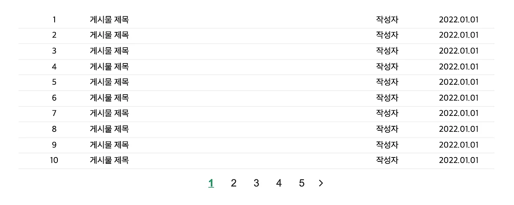
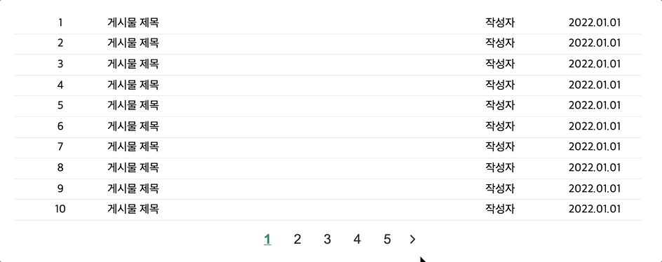

# 페이지네이션이란?

페이지네이션(Pagination)은 다수의 콘텐츠를 여러 페이지로 나누고, 이전 또는 다음 페이지로 넘어가거나 특정 페이지로 이동할 수 있는 버튼을 제공하는 기술입니다. 페이지네이션은 공통된 주제로 묶은 글의 목록을 보여주는 게시판과 같은 곳에서 많이 사용되고 있습니다. 비슷한 목적의 기술로 무한 스크롤(Infinite Scroll)도 있는데, 이에 대한 특징은 이전 게시물에서 다루었으니 본문에서는 페이지네이션의 장단점만 살펴보겠습니다.

### 페이지네이션의 장점

- 사용자가 콘텐츠를 페이지 단위로 명확하게 탐색할 수 있습니다.
- 특정 콘텐츠의 위치를 간편하게 탐색할 수 있습니다.
- 한 번에 로드되는 콘텐츠의 수가 제한되어 있어 로딩 속도가 빠릅니다.
- 페이지마다 고유한 URL(`/page/1`)을 가지므로, SEO에 친화적입니다.

### 페이지네이션의 단점

- 사용자 입장에서 페이지 이동이라는 추가적인 행동(클릭)이 발생합니다.
- 한 페이지에 나타나는 정보량이 제한적입니다.

페이지네이션과 무한 스크롤은 각자의 고유한 특징과 서로 상호보완적인 부분이 명확하게 존재하기 때문에, 만들고자 하는 애플리케이션의 성격에 맞게 결정하면 됩니다. 제 블로그를 기준으로 경험을 공유드리면, 스토리를 최대 9개까지만 보여주고 싶었기에 페이지네이션을 구현해 적용했습니다.

이제 간단하게 페이지네이션을 구현해 볼까요?


# 페이지네이션 구현하기

## 예제로 준비한 HTML/CSS 코드

이번 예제는 어디서나 쉽게 접할 수 있는 간단한 게시판 형태로 디자인했습니다.



> 제가 공유 드린 코드를 보면서 차례대로 진행했을 때 처음에는 화면이 비어 있어 당황하실 수 있는데, 표시할 콘텐츠를 모두 자바스크립트로 동적 생성해서 그렇습니다. 그러니 놀라지 마세요 😄

### HTML 코드

```html title="index.html"
<!doctype html>
<html lang="ko">
  <head>
    <meta charset="UTF-8" />
    <title>Pagination</title>
    <!-- Styles -->
    <link rel="stylesheet" href="style.css" />
  </head>
  <body>
    <article class="article">
      <ul class="contents"></ul>
      <div class="buttons"></div>
    </article>
    <!-- Scripts -->
    <script type="module" src="https://unpkg.com/ionicons@5.5.2/dist/ionicons/ionicons.esm.js"></script>
    <script nomodule src="https://unpkg.com/ionicons@5.5.2/dist/ionicons/ionicons.js"></script>
    <script src="app.js"></script>
  </body>
</html>
```

스크립트를 불러오는 부분에서 `ionicons.js`라는 모듈을 추가적으로 불러왔습니다. [ionicons](https://ionic.io/ionicons)는 여러 아이콘을 간단한 태그 형식으로 사용할 수 있는 라이브러리입니다. 이번 예제에서 이전(prev), 다음(next) 페이지 버튼에 아이콘을 넣기 위해 사용했습니다. 사용 방법은 크게 어렵지 않으니 궁금하신 분들은 공식 문서를 확인해 보세요. 라이브러리를 불러오고, 사용하고자 하는 아이콘 태그를 복사/붙여넣기 하면 끝입니다.

### CSS 코드

```css title="style.css"
* {
  margin: 0;
  padding: 0;
  box-sizing: border-box;
}

.article {
  max-width: 960px;
  margin: 0 auto;
  padding: 2rem;
  text-align: center;
}

.content {
  display: flex;
  padding: 0.3em 0;
  list-style: none;
  border-bottom: 1px solid rgba(0, 0, 0, 0.08);
}

.content__id,
.content__author,
.content__date {
  flex-basis: 15%;
}

.content__title {
  flex: 1;
  text-align: left;
  overflow: hidden;
  white-space: nowrap;
  text-overflow: ellipsis;
}

.buttons {
  position: relative;
  padding: 1rem 0;
  display: inline-flex;
  justify-content: center;
}

.button {
  padding: 0 1rem;
  font-size: 1.2rem;
  color: #333;
  background: transparent;
  border: 0;
  outline: 0;
  cursor: pointer;
}

.button.active,
.button:hover {
  color: #1f975d;
  font-weight: 600;
  text-decoration: underline;
}

.prev {
  position: absolute;
  left: -2.5rem;
}

.next {
  position: absolute;
  right: -2.5rem;
}

ion-icon {
  padding-top: 0.05rem;
}
```

## 자바스크립트 로직 작성

### 필요한 변수 선언

```javascript title="app.js"
const contents = document.querySelector('.contents');
const buttons = document.querySelector('.buttons');

const numOfContent = 178;
const showContent = 10;
const showButton = 5;
const maxPage = Math.ceil(numOfContent / maxContent);
let page = 1;
```

각 변수의 용도는 다음과 같습니다.

- contents: 콘텐츠 목록을 담기 위한 부모 컨테이너
- buttons: 페이지 버튼을 담기 위한 부모 컨테이너
- numOfContent: 전체 콘텐츠 개수
- maxContent: 한 페이지에 보여줄 콘텐츠의 최대 개수
- maxButton: 한 화면에 보여줄 페이지 버튼의 최대 개수
- maxPage: 콘텐츠를 모두 보여주기 위해 필요한 페이지의 개수
- page: 현재 페이지(본 예제에서는 시작 페이지를 1로 정의)

[Math.ceil](https://developer.mozilla.org/ko/docs/Web/JavaScript/Reference/Global_Objects/Math/ceil) 메서드는 인자로 들어온 값보다 크거나 같은 숫자 중 가장 작은 정수를 반환합니다. 보유하고 있는 글의 개수가 178개이기 때문에, 이를 10개씩 보여주기 위해서는 총 18페이지가 필요합니다. 178을 10으로 나눴을 때의 결과는 17이지만, 해당 메서드에 의해 18을 반환하여 저장합니다.

### 글 목록 & 버튼 생성 함수 구현

본 예제에서는 콘텐츠 목록과 버튼을 동적으로 생성하기 때문에 함수로 만들어 재사용했습니다.

```javascript title="app.js"
const makeContent = (id) => {
  const content = document.createElement('li');
  content.classList.add('content');
  content.innerHTML = `
    <span class="content__id">${id}</span>
    <span class="content__title">게시물 제목</span>
    <span class="content__author">작성자</span>
    <span class="content__date">2022.01.01</span>
  `;
  return content;
};

const makeButton = (id) => {
  const button = document.createElement('button');
  button.classList.add('button');
  button.dataset.num = id;
  button.innerText = id;
  button.addEventListener('click', (e) => {
    Array.prototype.forEach.call(buttons.children, (button) => {
      if (button.dataset.num) button.classList.remove('active');
    });
    e.target.classList.add('active');
    renderContent(parseInt(e.target.dataset.num));
  });
  return button;
};
```

두 함수는 요소를 만들어 반환하는 단순한 기능만을 수행하는데, 버튼의 경우는 눌렀을 때 해당 페이지의 콘텐츠 목록을 불러와야 하기 때문에 이벤트 리스너도 추가했습니다. 특정 버튼을 클릭하면 그 버튼은 활성화시키고, 다른 버튼은 비활성화 상태가 되어야하므로 반복문을 사용해 클래스를 조정했습니다.

### 렌더링 함수 구현

렌더링 함수는 화면에 콘텐츠 목록과 버튼을 그리는 함수입니다.

```javascript title="app.js"
const renderContent = (page) => {
  // 목록 리스트 초기화
  while (contents.hasChildNodes()) {
    contents.removeChild(contents.lastChild);
  }
  // 글의 최대 개수를 넘지 않는 선에서, 화면에 최대 10개의 글 생성
  for (let id = (page - 1) * maxContent + 1; id <= page * maxContent && id <= numOfContent; id++) {
    contents.appendChild(makeContent(id));
  }
};

const renderButton = (page) => {
  // 버튼 리스트 초기화
  while (buttons.hasChildNodes()) {
    buttons.removeChild(buttons.lastChild);
  }
  // 화면에 최대 5개의 페이지 버튼 생성
  for (let id = page; id < page + maxButton && id <= maxPage; id++) {
    buttons.appendChild(makeButton(id));
  }
  // 첫 버튼 활성화(class="active")
  buttons.children[0].classList.add('active');

  buttons.prepend(prev);
  buttons.append(next);

  // 이전, 다음 페이지 버튼이 필요한지 체크
  if (page - maxButton < 1) buttons.removeChild(prev);
  if (page + maxButton > maxPage) buttons.removeChild(next);
};

const render = (page) => {
  renderContent(page);
  renderButton(page);
};
render(page);
```

콘텐츠를 페이지당 최대 10개씩, 그리고 버튼을 한 화면에 최대 5개만 보이도록 구현했습니다. 조건문 안의 수식을 그냥 보기만 하면 어렵게 느껴질 수 있는데, 천천히 값을 하나씩 대입해 가면서 보면 금방 이해하실 거라 생각합니다.

### 페이지 이동 함수 구현

마지막으로 이전 페이지와 다음 페이지로 이동할 수 있는 버튼을 만들면 됩니다.

```javascript title="app.js"
const goPrevPage = () => {
  page -= maxButton;
  render(page);
};

const goNextPage = () => {
  page += maxButton;
  render(page);
};

const prev = document.createElement('button');
prev.classList.add('button', 'prev');
prev.innerHTML = '<ion-icon name="chevron-back-outline"></ion-icon>';
prev.addEventListener('click', goPrevPage);

const next = document.createElement('button');
next.classList.add('button', 'next');
next.innerHTML = '<ion-icon name="chevron-forward-outline"></ion-icon>';
next.addEventListener('click', goNextPage);
```

여기서는 크게 어려운 계산 없이 현재 페이지의 값만 바꿔주면 끝입니다. 현재 페이지가 1일 때 다음 페이지 버튼을 누르면 5(`maxButton`)가 더해져서 6이 되도록 말이죠. 그런 식으로 처리하고 마지막에 다시 한 번 렌더링 함수를 호출하면 바로 이어지는 결과 화면을 확인할 수 있습니다.

## 구현 결과

8~90줄 정도의 짧은 코드로 간단하게 페이지네이션을 구현해 봤습니다.



예제에서는 미리 데이터의 개수를 정해두고 화면에 띄우는 식으로 구현했지만, 실제 서비스에서는 DB에 저장된 데이터를 받아오는 식으로 구현해야 합니다. DB를 사용할 때도 지금과 전체적인 구현 방식은 비슷하기 때문에, 일단 한 번 직접 구현해 보면서 감을 익혀보면 좋을 것 같습니다.

# 참고 자료

- [JS로 Pagination 구현하기](https://velog.io/@eunoia/JS%EB%A1%9C-Pagination-%EA%B5%AC%ED%98%84%ED%95%98%EA%B8%B0)
- [무한 스크롤 vs 페이지네이션](https://slowalk.com/2596)
