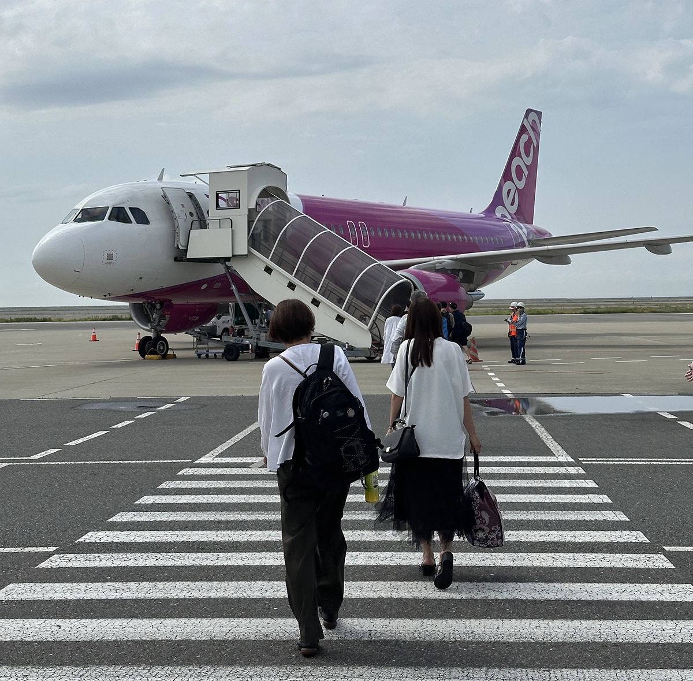
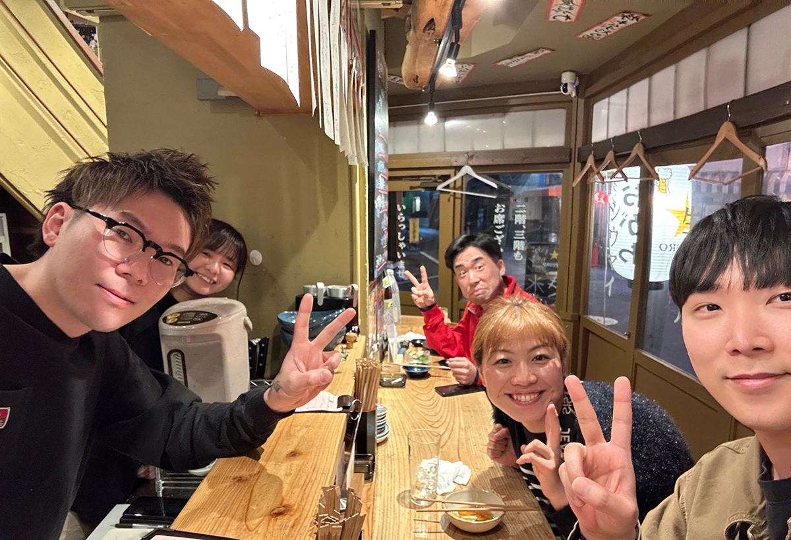
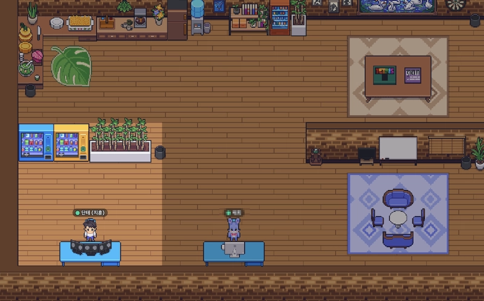
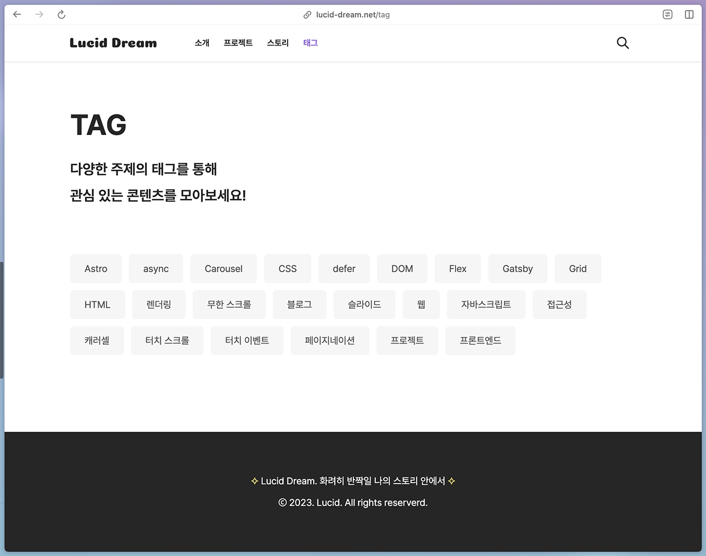

# 최근 근황

루시드 드림이란 [블로그를 만들었을 당시 작성했던 글](/story/project/post/lucid-dream) 이후로 굉장히 오랜만에 새로운 글을 쓰는 거 같습니다. 마지막으로 작성했던 게 2023년 12월이었으니, 벌써 8개월이라는 시간이 흐른 거네요. 아무 소식을 전하지 않았기에 개발을 접은 거 아니냐 생각하셨을 수 있지만, 그동안에도 개발 공부는 꾸준히 하고 있었습니다. 다만, 직전 스타트업에서 일했을 때 일에 너무 집중한 나머지 개인을 많이 챙기지 못한 것에 대한 아쉬움으로, 재취업은 잠시 미뤄두고 하고 싶었던 것들을 하고 장기간 일본 여행도 다녀오면서 에너지 충전을 했습니다.

2023년 10월 말 퇴사 후부터 지금까지의 근황을 시간대 순으로 짧게나마 공유해 볼게요.

## 장기간의 일본 여행

예전부터 일본 드라마와 애니메이션을 즐겨 보고 있는데, 일본은 이와 같은 서브컬처 문화를 즐길 수 있는 시스템이 많이 갖춰져 있고, 맑은 하늘과 함께 색다른 느낌의 배경에서 힐링이 잘 되기에 짧게라도 종종 다녀오고 있습니다. 하지만, 늘 다니던 곳 위주로만 다녔던 아쉬움에 어느 정도 시간이 확보된 이번 기회에 아직 가보지 못했던 도쿄부터 시작하여 나가사키까지 많은 곳을 다녀왔습니다. 로컬 항공사인 피치와 고속 열차인 신칸센도 처음 타봤는데, 처음에는 걱정이 많았지만 이용 방법이 우리나라와 큰 차이가 없었고, 직원 분들도 친절하게 응대해 주셔서 편하고 안전하게 이용할 수 있었습니다.

그리고 저는 여행을 보통 혼자 다니는 편이고 최대한 로컬 문화를 체험하는 것을 좋아합니다. 그래서 일본 분들이 많은 곳 위주로 다니면서 많은 분들과 이야기를 나눠볼 기회가 많았는데, 그러는 동안 친구도 많이 사귀고 즐거운 경험을 잔뜩 만들었습니다.

여행은 맛있는 걸 많이 먹고, 다양한 걸 보러 다니는 것도 좋지만, 스몰 톡으로 시작해서 다양한 분들과 교류해 보는 것도 하나의 묘미라 생각합니다. 외국어를 잘 몰라도 요즘은 번역기가 잘 되어 있어서 크게 문제가 없더라고요. 그렇게 라인이나 인스타그램까지 공유하게 되고, 제가 좋은 모습으로 비쳤는지 모르겠으나 지금까지도 좋은 관계를 유지하고 있습니다. 알게된 분들 중 마츠모토라는 분과는 두 세 차례 만났었는데, 뵐 때마다 공감대가 많아 이야기가 한 시도 끊이지 않고 즐거웠습니다. 특히 술 한 잔 하고 돌아가는 길에서 둘이 [바람이 되어(고양이의 보은 OST)](https://www.youtube.com/watch?v=lHWVOfC41L4)라는 노래를 불렀을 때는 얼마나 웃겼는지..

국내 여행과 또 다른 재미로 일본 여행을 갈 때마다 즐거운 기억이 하나씩 쌓여가기에, 앞으로도 시간이 있으면 계속 다녀올 생각입니다.

## 일본어 공부와 JLPT 시험

꽤 오랫동안 일본 여행을 다녀오면서 일본어 공부를 본격적으로 시작해 보고 싶었습니다. 완전히 노베이스는 아니지만 자격증을 따로 갖고 있는 것도 아니기에, 이왕이면 관심이 있는 지금 하나 마련해 보는 건 어떨까 생각했습니다. 그래서 일본에서 여행 중이던 4월에 JLPT 일본어 능력 시험을 접수하고, 귀국 후 5월부터 문법부터 시작하여 본격적으로 공부하기 시작했습니다. 책으로만 공부한 건 아니고 평소에도 즐겨 보던 드라마는 계속 챙겨보고, 일본에서 사귀거나 어플을 통해 알게 된 분들과의 전화를 통해서도 공부했습니다.

그렇게 7월 7일에 시험을 쳤는데 나름 문제가 잘 풀려서 다행이었습니다. 점수가 얼마나 나올지는 모르겠지만, 문제를 불법 복원 해주신 중국인 형님(?)들 덕에 가채점해 본 결과 합격 할 거 같다는 자신이 들었습니다. 일본에서 주관하는 거라 결과 발표가 두 달 정도까지 걸린다고 하는데 얼른 받아서 이력서 같은 곳에 추가하고 싶네요.

일본어 공부는 시험을 위해서 시작한 것도 있지만, 일본인 분들과 더욱 자연스럽게 교류하고, 제 자신의 가치를 일본에까지 확장하기 위해 시작한 게 주된 이유이기에 멈추지 않고 꾸준하게 이어나갈 계획입니다.

## 사이드 프로젝트

스타트업에서 프로젝트를 혼자서 수행하면서 늘 마음속에 아쉬움으로 자리 잡은 것이 있었는데, 협업을 제대로 경험해 보지 못했다는 점입니다. 적은 인원으로 많은 제품을 만들어야 했기에 이해는 하나 결국 마지막까지 해소하지 못하고 나오게 됐습니다. 관련하여 재직 당시 친하게 지내던 디자이너님께 고민을 얘기했던 적이 있었는데, 어떻게 좋은 기회가 생겨서 최근부터 함께 사이드 프로젝트를 진행하게 되었습니다. 인원은 개발자와 디자이너 각각 1명으로 구성했는데, 서로 도전하고 싶은 도메인이 다양했기에 지금은 이렇게 시작하여 인원 확장은 추후 고려하는 쪽으로 결정했습니다.

전체적인 기획은 함께 진행하며 각각 맡은 역할은 다음과 같습니다.

- 개발자: 풀스택 개발
- 디자이너: UIUX 디자인, 디테일한 기획, 마케팅

디자이너님께서 실력도 좋으시고 열정도 넘치시기에 저만 잘하면 된다는 생각이 참 많이 들긴 하는데, 배포에서 끝나는 것이 아닌 지속 가능한 서비스를 만들어 가는 것을 목표로 하는 의미 있는 프로젝트이기에 끝까지 열심히 참여하려 합니다. 기술 스택으로는 평소 사용해 보고 싶었던 `Nextjs`와 `Nestjs`를 각각 프론트엔드와 백엔드에 적용할 생각이고, `인증`부터 시작하여 `결제`까지 다양한 모듈을 붙여볼 기회도 잡았으니 서비스가 만들어지는 과정을 제대로 경험하며 한 층 더 성장하고자 합니다.

지금 시작하는 프로젝트 외에도 개인적으로 만들고 싶은 서비스가 하나 있긴 한데, 이거는 현재 만들고 있는 서비스의 MVP 출시 후 여유가 생길 때 만들어 볼 생각입니다. 일단 지금 만들고 있는 사이드 프로젝트부터 좋은 결과를 맞이할 수 있으면 좋겠습니다.

## 취업 준비

어쨌든 오랫동안 휴식을 했기 때문에 이제는 다시 취업을 해서 커리어를 이어 나가고자 합니다. 아직 주니어 개발자에 포트폴리오로 내세울 만한 것이 많지는 않지만, 일단 이력서는 여러 군데 제출해 둔 상태이고, 지금 진행 중인 사이드 프로젝트가 자랑스럽게 내세울 수 있는 하나의 포트폴리오로서 활약할 순간을 기대하며 열심히 달리고 있습니다. 그러면서도 평소 관심을 갖고 있던 주제인 `함수형 프로그래밍`을 비롯해 `웹 개발`과 `데이터베이스 설계` 등의 이론적인 부분도 틈틈이 공부하고 있습니다.

직전 스타트업은 운이 좋아서 빠르게 취업을 했던 케이스이기에 재취업까지 어느 정도의 시간이 걸릴지 모르겠으나, 조급해하지 않고 개발 자체를 즐기면서 차근차근 준비해 나가려 합니다. 좋은 개발 문화가 자리 잡힌 곳에서 좋은 경험을 쌓고 많은 분들께 공유드릴 수 있으면 좋겠네요.

# 블로그 방향에 대한 고민

오랜 기간 여행을 다니고 일본어도 공부하고 있었기에 블로그 활동 자체를 소홀히 했던 건 맞습니다. 하지만, 한 편으로는 좋은 글을 전달하고 싶기도 했고, 그렇다고 하면 어떤 내용의 이야기를 공유하는 것이 좋을까 늘 고민하고 있었기에 늦어진 것도 있습니다. 이에 대한 답은 사이드 프로젝트를 시작하고 기능을 만들기 위해 고민하던 순간 얻을 수 있었는데, 무엇인가 만들었을 때를 비롯해 내가 겪은 경험을 공유하는 것이 많은 분들이 읽어주시는 좋은 글이 되지 않을까 하는 생각이 들었기 때문입니다.

그리고 자바스크립트 스토리 쪽에서 확인 가능한 [페이지네이션 구현하기](/story/javascript/post/simple-pagination)나 [무한 스크롤 구현하기](/story/javascript/post/infinite-scroll-intersection-observer)와 같이 무엇인가 만들어 본 경험을 공유하는 콘텐츠들이 과거 티스토리에서 활동하던 당시에도 관심도가 높았던 기억도 있습니다. 그렇기에 이제는 최대한 저의 경험을 녹여 넣을 수 있는 글을 써나가고자 합니다.

## 스토리 주제 결정

앞으로 작성해 나갈 스토리의 주제는 다음과 같이 분류해 볼 수 있을 것 같습니다.

- 프로젝트를 통해 진행하면서 얻은 경험 (ex. 소셜 로그인을 붙여본 경험, 최적화 경험 등)
- 간단하게 만들어 보는 작은 기능 (ex. 페이지네이션, 캐러셀, 라이트 박스 등)
- 블로그나 일정 관리 앱 만들기와 같은 주제의 시리즈물

다양한 기술로 소개하는 것도 좋지만 개인적으로 `React`, `Nextjs`, `Astro`, `NestJS`, `함수형 프로그래밍` 위주로 많은 관심을 쏟고 있기 때문에 이들을 중심으로 채워나갈 것 같습니다. 이것저것 게시하는 것도 물론 좋지만, 특정 도메인에 집중해서 얻은 인사이트를 공유하는 것도 높은 가치가 있을 거라 생각합니다. 그리고 시리즈 형태로 작성되는 스토리 중에서 괜찮은 반응을 얻은 글이 있다면, 추후 인프런과 같은 서비스를 통해 추가 등록해서 공유해 볼 계획입니다.

## 새로운 기능 추가 및 계획

블로그를 만들면서 제목과 본문 내용 기반으로 스토리를 찾을 수 있는 검색 기능을 첫 버전에서 추가했습니다. 하지만, 관심 있는 태그만 모아서 확인하는 것에 대한 수요가 생각보다 높음을 확인하고, 이를 위해 모든 태그를 한눈에 확인하여 관심 있는 태그의 스토리만 모아서 볼 수 있는 페이지를 추가했습니다.

지금은 게시물이 많지 않기 때문에 열거해 놓은 태그를 보는 데 큰 문제가 없으나, 추후 태그가 많아졌을 때를 고려해서 이 페이지에도 검색 기능을 간단하게 추가할 계획이 있습니다. 마침 최근에 토스에서 편리하게 한글을 다룰 수 있는 [es-hangul](https://es-hangul.slash.page/)이란 라이브러리를 만들어 공유해 주셨더라고요. 기능을 만들기 시작할 때, 한 번 활용해 보면 좋을 거 같습니다.

그리고 좀 투머치이긴 한데 다국어 지원도 언젠가는 한 번 추가하고 싶은 생각이 있습니다. 사실 우리나라 제외하면 블로그 유입이 얼마나 있을지는 모르겠지만, 일본어 공부도 꾸준히 하고 있기에 개인적으로는 소개 페이지를 비롯한 일부 부분이라도 적용해 보고 싶네요. 물론 당장 필요한 이유는 없기에 먼 미래에나 시도해보지 않을까 싶긴 합니다.

# 마치며

한동안 잊고 있었는데 취준을 다시 시작하면서, 확실히 시장의 문이 많이 좁아지긴 했구나를 어느 정도 체감하고 있습니다. 제가 참여하고 있는 개발자 단톡과 개발 관련 커뮤니티도 자주 확인하는데, 많은 분들께서 취업을 위해 큰 힘을 쏟고 계시더라고요. 취준에 대해서는 비교적 최근에 합류했지만, 이력서와 자기소개서를 비롯해 포트폴리오를 만들어 가는 과정에서의 노고를 저도 경험해서 공감하고 있기에 모두 힘내서 좋은 결과 얻을 수 있으면 좋겠습니다.

글을 쓰거나 무엇인가 만들어 가는 행위 자체는 취미의 한 부분으로서 즐기기에 서류 작성에서 받는 스트레스는 없으나, 그래도 들어가는 시간이 많아 힘이 부칠 때가 있긴 합니다. 그래도 이런 저를 믿고 지지해 주는 가족과 일본인이지만 늘 본인의 일처럼 생각하고 응원해주는 여자친구 덕에 많은 힘을 얻고 있습니다.

앞으로 좋은 이야기를 들려드릴 수 있도록 블로그 활동은 꾸준히 할 것이니 많은 관심 부탁드립니다!
