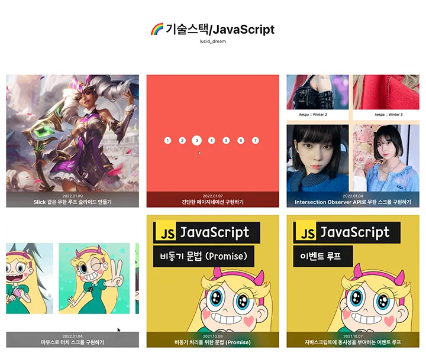
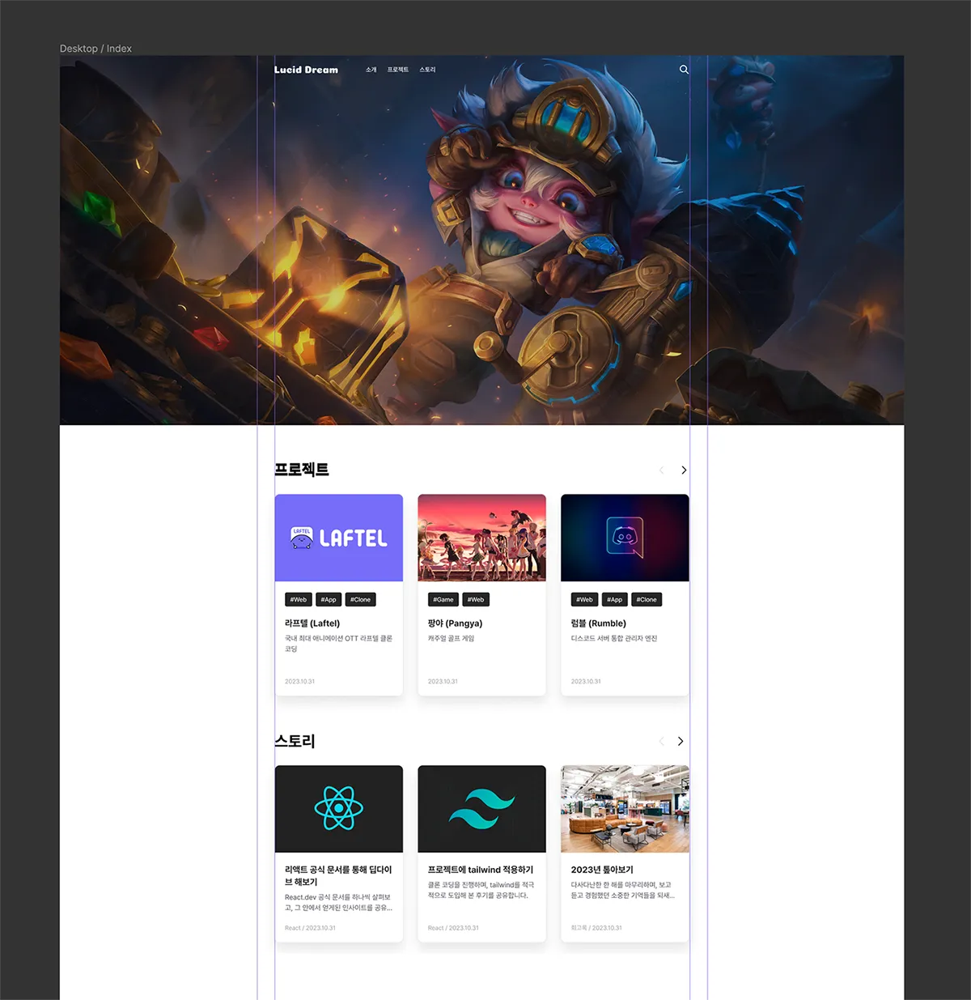
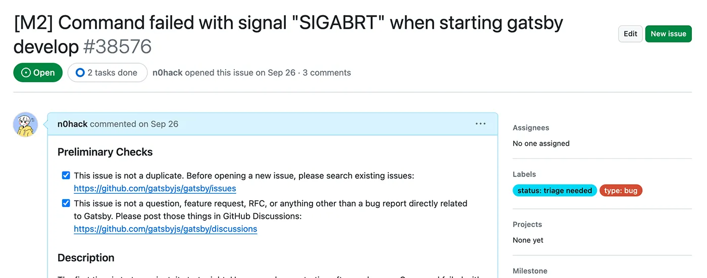
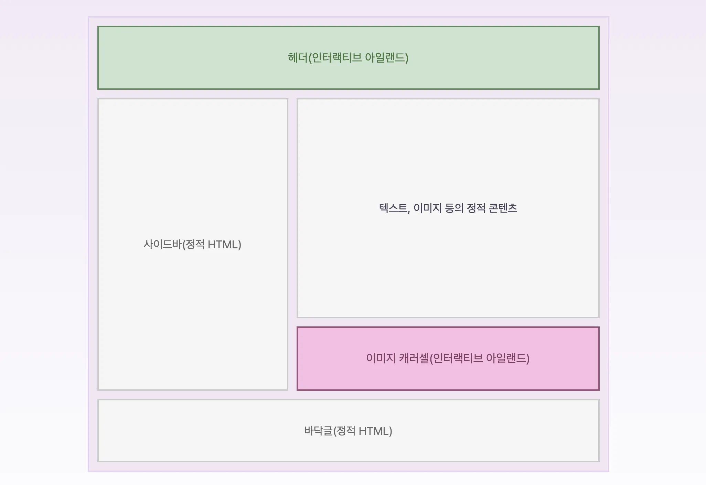
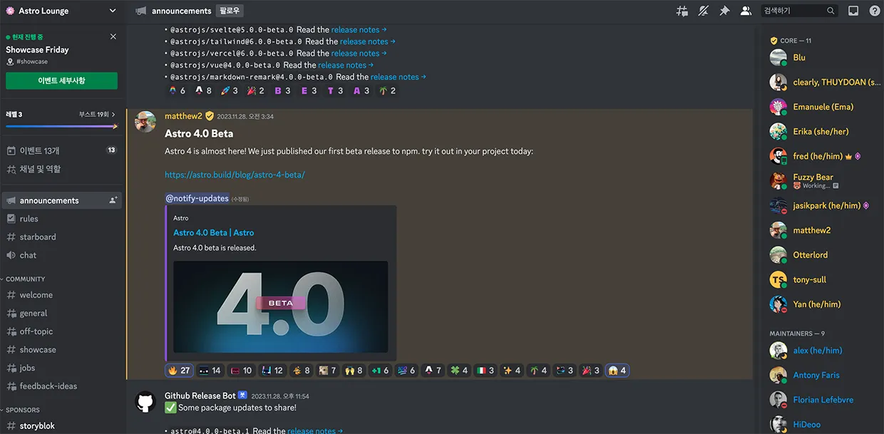
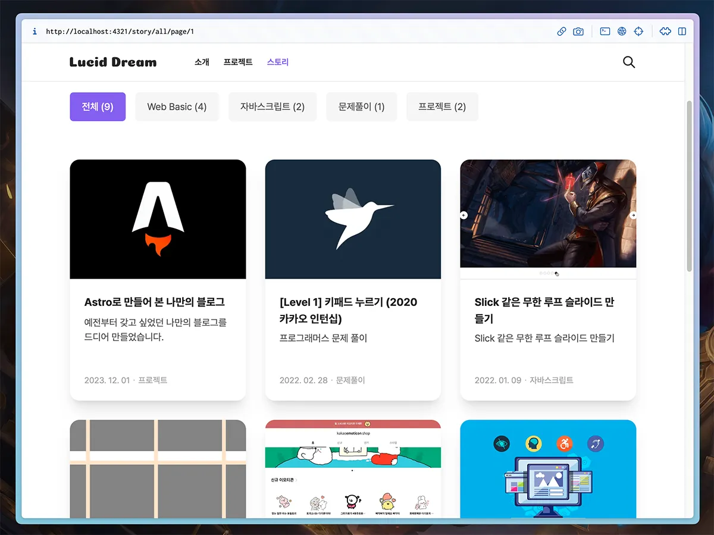
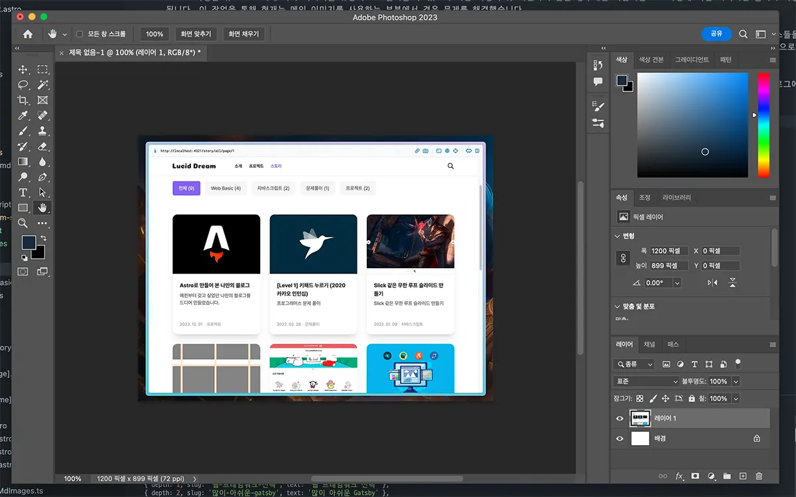
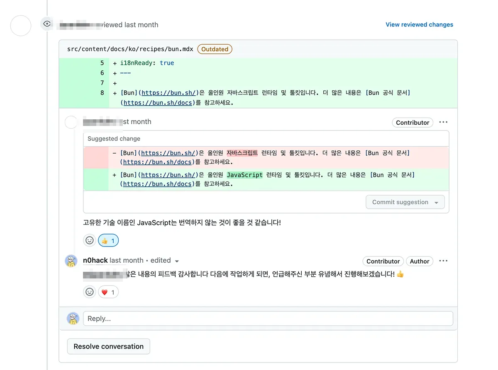

# 시작하며

## 블로그를 하는 이유와 직접 만들게 된 계기

저는 개발을 본격적으로 시작하기 이전부터 네이버나 티스토리에서 블로그 활동을 해왔습니다. 애니메이션을 좋아하던 고등학생 때는 신작 소개나 리뷰 등의 콘텐츠로 블로그를 운영했었고, 대학생이 되어서는 게임을 좋아하게 되면서 공략을 비롯한 가이드 중심의 콘텐츠로 블로그를 운영했었습니다. 각 블로그를 운영한 햇수 자체가 그리 긴 편은 아니었지만, 작성했던 글들에 달린 댓글에서 내가 제공한 정보가 누군가에게 많은 도움이 되었다는 것을 알게 되었고, 때로는 댓글에서 주고받은 피드백을 통해 글의 품질이 올라가는 것을 경험하기도 했습니다. 블로그를 운영하면서 발생한 커뮤니케이션들이 긍정적인 자극들로 다가와 블로그 활동 자체를 좋아하게 만들었습니다.

프론트엔드 개발자로 진로를 변경하고 공부하기 시작한 2021년 말부터는 티스토리에 공부한 내용을 정리하면서, 한 편으로는 저와 같은 프론트엔드 새내기 분들께 도움을 드리고자 `페이지네이션 구현하기`, `이벤트 루프 소개`와 같은 주제로 글을 쓰기 시작했습니다. 앞서 언급했던 경험이 블로그 활동을 이어가게 하는 동력이었기에, 글의 방향을 이와 같이 설정했었습니다.

_티스토리에서 운영했던 블로그 (feat. 별나비)_

방향에 맞춰 글도 하나둘씩 쌓여갔고, 시간이 지남에도 블로그 운영에는 큰 문제가 없었지만, 학습이나 문제 해결을 위해 참조한 기술 블로그들을 보면서 직접 만들어 보면 어떨까 하는 생각이 종종 들었습니다. 플랫폼처럼 일관된 디자인이 아닌 저마다의 개성이 담겨 있었던 것과 기능을 자유롭게 추가 가능하다는 점이 꽤나 마음에 들었기 때문입니다. 그래서 티스토리에서 활동하는 것이 지금 당장은 큰 문제가 없다고 했지만, 앞으로 디자인 변경이나 기능 추가를 하고 싶을 때를 생각해 보면 플랫폼 특성상 제약이 많기 때문에, 직접 만들자는 결정을 내리게 되었습니다.

하지만 결정을 내린 시기에 스타트업에 취업하게 되면서, 아쉽게도 프로젝트를 바로 시작하지는 못했습니다. 처음에는 일을 마치고 하면 될 것 같았지만, 여러모로 부족한 여건과 급박한 일정 안에서 서비스 런칭을 위해 평일, 주말 구분 없이 밤낮으로 구르고 있었기에 물리적으로 여유가 없었습니다. 어떻게 1년이라는 시간이 지나 런칭을 하고, 현재는 개인적인 사정에 의해 퇴사하게 되어, 만들고 싶었던 것들을 다시금 만들어 보려 합니다. 야근할 때마다 만들고 싶은 게 정말 많이도 생겼는데, 일단 전부터 계획했던 블로그부터 천천히 만들기로 했습니다.

## 기획과 디자인부터

머리로는 구상을 어느 정도 끝냈기 때문에 바로 개발을 들어가도 상관없었지만, 직전 회사에서 기획이나 디자인의 부재로 많은 고통을 받았던 경험이 떠올라 LO-FI라도 간단하게 만들어 진행하는 쪽으로 결정했습니다. 기획은 노션에서 했으며, 디자인은 피그마 외에도 자캐(자신의 캐릭터)를 직접 만들고 싶어 아이패드의 [프로 크리에이트](https://procreate.com/)도 사용했습니다.

_피그마에서 작업한 메인 페이지_

평소 디자인에도 관심이 많았기 때문에, 잠깐이나마 공부했었던 피그마를 나름 깊이 있게(?) 다뤄볼 수 있는 유익한 시간이었습니다. 이번에는 유튜브를 보면서 익힌 컴포넌트와 스타일을 등록해 디자인해 가는 과정 정도를 적용해 봤는데, 다음에 또 혼자 디자인할 일이 있으면 피그마에 새롭게 추가된 개발자 모드에 대한 공부도 해볼 계획입니다. 이런 경험들이 나중에 디자이너님들과 협업할 때 좋은 자산이 되지 않을까 싶네요.

> 페이지 디자인에 사용한 모든 이미지는 라이엇게임즈에서 제공하는 리그 오브 레전드 공식 이미지입니다.

# 웹 프레임워크 선택

## 뭔가 많이 아쉬운 Gatsby

블로그를 비롯한 정적 콘텐츠 중심의 사이트를 만들 때, 대부분 리액트 기반의 프레임워크인 `Gatsby`를 선택하는 편입니다. Gatsby는 정적 사이트 생성을 간단하게 할 수 있는 프레임워크 중에서 긴 역사를 가졌으며, `Netlify`에서 인수해 사용자들로 하여 많은 기대를 받기도 했습니다. 저도 처음에는 리액트가 편하기도 해서 Gatsby로 프로젝트를 시작했습니다만, 몇 가지 해결되지 않는 문제를 만나면서 Gatsby에 대한 마음을 완전히 접고 아래에서 기술할 `Astro`로 넘어오게 되었습니다.

Gatsby를 사용하면서 겪은 문제는 다음과 같습니다.

### ① 너무 오래 걸리는 빌드 시간

Gatsby는 `Webpack`을 기본 번들러로 사용하기 때문에, 개발 서버에서의 로딩이나 빌드 속도가 모던 번들러들에 비해 많이 느린 편입니다. 캐싱이나 코드 스플리팅, 또는 플러그인 주입을 통해 성능을 개선하는 방법도 있다고는 하나, 눈에 띄게 좋아진 사례도 크게 찾아볼 수 없었습니다. 저 또한 실제로 개선을 시도하기도 했으나, 단순히 프로토타입 수준으로 만든 프로젝트의 빌드 시간이 1분가량에서 나아지는 모습을 보진 못했습니다. 글이나 이미지 등의 리소스들이 계속해서 늘어날 블로그의 특성상 빌드가 오래 걸리는 것은 Gatsby로 개발해야 할 이유를 느끼지 못하게 만들었습니다.

> 저는 22년도에 `CRA(Create React App)`를 사용해 프로젝트를 진행했을 때 이후로는 Webpack을 사용하고 있지 않기 때문에, 지금은 얼마나 성능 개선이 있었을지 잘 모르겠습니다 😅

### ② 지속적으로 제기되는 이슈, 관리되지 않는 프로젝트

언제부터인가 개발 서버를 실행하거나 빌드를 할 때, 메모리 관련 문제가 지속적으로 발생했습니다. 제가 사용하고 있는 맥북 M2에서만 발생하는지는 모르겠지만, 이는 프로젝트 실행 자체가 되지 않는 치명적인 문제였습니다. 개발 서버 실행이나 빌드 전에 항상 `gatsby clean` 명령을 수행하는 식으로 임시 해결하는 편법이 있었지만, 굳이 불필요한 작업이었으며, 여기에도 소요되는 시간이 있었기에 많은 불편함을 느꼈습니다. 그래서 문제 해결을 위해 Gatsby 저장소를 찾아가 동일한 이슈를 찾아봤는데, 동일한 이슈를 겪은 사용자들은 많았으나 해결한 사례는 찾지 못했습니다.

M2에서 발생한 경우에 대한 이슈는 따로 없었기 때문에 제가 직접 이슈를 발행했고, 과거 메인테이너였던 개발자([LekoArts](https://github.com/LekoArts))로부터 다음의 답변을 받을 수 있었습니다.

_Gatsby 저장소에 직접 발행한 이슈_

> Hey there 👋 It hurts me to say this but I no longer work at Gatsby, so I won't be able to help you. Netlify laid off a lot of people including me and others have left since then, too. If you want to get your voice heard you'll need to contact Netlify, the people left who might work on this repository are not at fault.

내용을 정리하면 Gatsby를 인수한 Netlify에서 대규모 정리 해고가 있었는데, 그중에는 Gatsby의 핵심 인물들(Sam, Kyle 등의 창시자 포함)이 대거 포함되어 있었다는 이야기입니다. 이로 인해 내부에서 유지보수가 원활하게 이루어지지 않고 있고, 인수되기 전처럼 오픈 소스로 돌아가야 그나마 쌓이고 있는 문제들을 해소할 수 있을 거라 생각합니다. 길게 이어져온 프레임워크에 탄탄한 사용자층도 보유하고 있기에 그냥 무너지진 않을 것으로 예상하지만, 해결되길 마냥 기다릴 수도 없는 노릇이기에 다른 프레임워크를 찾기로 결정했습니다.

## Astro 프레임워크

요즘은 하루가 멀다 하고 프론트엔드 영역에 새로운 웹 프레임워크들이 등장하고 있는데, 저는 유튜브의 `Fireship` 채널에서 100초 시리즈로 소개한 [Astro](https://astro.build/)라는 웹 프레임워크에 관심을 가져봤습니다. 공식 문서를 확인하면서 기본적인 블로그 구축이 어떻게 얼마나 가능한지, 개발자 경험은 괜찮은지 테스트를 진행했고, 긍정적인 특징들을 다수 확인함으로써 블로그를 Astro로 만들기로 했습니다.

### ① 아일랜드 아키텍처

공식 문서에서 Astro는 [아일랜드 아키텍처](https://www.patterns.dev/vanilla/islands-architecture)라는 렌더링 패턴을 본격적으로 내장한 첫 자바스크립트 웹 프레임워크라고 소개합니다.

_아일랜드 아키텍처_

Astro에서 작성된 모든 것들은 기본적으로 정적 요소로 빌드되지만, 개발자가 원한다면 특정 요소에 대해서는 렌더링 방식을 다르게 가져갈 수 있습니다. 만약 복잡한 상태를 갖고 있고, 인터랙션이 필요한 경우에는 클라이언트에서 렌더링 하는 `CSR(Client Side Rendering)` 방식으로 변경하는 것처럼 말이죠. 아일랜드 아키텍처에서는 이들을 독립적인 섬(아일랜드)으로 보고 있으며, 여기서 한 가지 재밌는 점은 각 섬들에 서로 다른 프레임워크를 사용해도 데이터를 주고받을 수 있다는 점입니다.

```astro title="layout.astro"
---
import Header from '@components/Header'; // 리액트로 만든 컴포넌트
import Footer from '@components/Footer.astro'; // 아스트로로 만든 컴포넌트

type Props = {
  headerBg?: boolean;
};

const { headerBg = false } = Astro.props;
---

<body>
  <Header hasBg={headerBg} client:load />
  <main>
    <slot />
  </main>
  <Footer />
</body>
```

위 코드처럼 React가 편한 개발자는 원하는 부분에 React를 사용할 수 있는 것처럼, 이 패턴은 기술 선택에 높은 자유도를 제공합니다. Astro는 전통적인 웹 개발 방식으로 마크업을 하기 때문에, 일부 복잡한 상태를 가진 컴포넌트를 구현할 때는 React와 같은 프레임워크의 도움을 받는 것이 편합니다. 저 또한 제가 기획하고 디자인한 헤더를 구현하기 위해 복잡한 상태가 필요했었는데, 이러한 특징 덕분에 문제없이 손쉽게 구현할 수 있었습니다.

### ② Vite 기반의 훌륭한 개발자 경험

Astro는 차세대 번들러 중 하나인 [Vite](https://ko.vitejs.dev/)를 탑재하여 빠른 로딩과 빌드 속도를 자랑합니다. 개발 서버 시작을 즉각적으로 할 수 있으며, 앱 크기에 상관없이 모듈이 변경된 부분만 화면에 반영하는 기능인 `HMR(Hot Module Replacement)` 역시 빠르게 동작하고, 매우 빠른 속도로 앱을 빌드하여 최적화된 결과물을 만들어 냅니다.

Gatsby에서 1분 정도 걸렸던 빌드 시간도, Astro로 넘어오면서 10초가 채 걸리지 않게 되었습니다.

> 본문에 언급된 빌드 시간은 로컬 환경에서 `build` 명령을 사용했을 때 기준입니다.

### ③ 활발한 디스코드 커뮤니티

요즘은 디스코드가 단순 게임 메신저를 넘어 다양한 분야의 커뮤니티로서 사용됩니다. 개발 분야 또한 예외는 아니며, 오히려 앞장서서 대부분의 프로젝트들이 디스코드에 서버를 두고 이 안에서 커뮤니케이션을 진행합니다. Astro도 디스코드를 주 커뮤니티로 사용하며, 공식 저장소에서는 프로젝트 자체에 대한 이슈가 아닌 이상은 디스코드에서 의견을 나눌 수 있도록 안내하고 있습니다.

여기서는 새로운 릴리즈를 일찍 공개하기도 하고, 새로운 기술이나 제품에 대한 웨비나도 진행하며, 기여자(Contributor)들 간 다양한 주제로 열띤 토론이 벌어지는 것도 볼 수 있습니다. 현재 Astro 외에도 개발 관련 서버를 여럿 참여하고 있는데, 그중 커뮤니케이션 발생 빈도가 체감상 높은 편에 속하는 것 같습니다.

_디스코드 서버 Astro Lounge_

활발한 커뮤니티인 것은 질의응답 채널(#support)에 새로운 글이 올라오고 답글이 달리는 속도를 봐도 바로 체감할 수 있습니다. 절대적인 정답은 아니지만, 멈추지 않고 오랫동안 계속 발전하기 위해서는 이렇게 활발한 커뮤니티가 필수 요건 중 하나라 생각하기에, 이런 부분들이 Astro에 대해 기대하게 만드는 것 같습니다.

# 기능 구현에 대한 경험 공유

## 카테고리와 페이지 단위로 정적 페이지 생성

저는 작성한 모든 글을 `스토리`라는 이름의 페이지에서 카테고리별로 그룹화한 후, 페이지네이션 처리하여 보여주기로 결정했습니다. 마크다운 문서와 같은 콘텐츠를 하나의 페이지로 보여주고자 한다면, 동적으로 경로를 생성할 수 있어야 하는데, Astro는 이를 간편하게 구현할 수 있도록 [동적 경로(Dynamic Routes)](https://docs.astro.build/en/core-concepts/routing/#dynamic-routes)라는 기능을 제공하고 있습니다.

동적 경로를 구성하는 기본 문법은 다음과 같습니다.

```astro title="src/pages/story/[story].astro"
---
export const getStaticPaths = () => {
  return [
    // 각 경로에 따라 다른 props 제공
    { params: { story: 'first' }, props: { data: 1 } },
    { params: { story: 'second' }, props: { data: 2 } },
  ];
};

const { story } = Astro.params;
const { data } = Astro.props;
---

<div>
  <p>글: {story}</p>
  <p>데이터: {data}</p>
</div>
```

위 코드에 의해 두 가지의 경로가 동적으로 생성됩니다.

- /story/first
- /story/second

`[story]`와 같이 대괄호로 감싸진 이름을 가진 파일은 동적 경로를 구성할 수 있는 파일로서, `getStaticPaths` 함수를 통해 경로를 생성할 수 있습니다. 또한 이 함수는 매개변수로 페이지네이션 구현을 도와주는 `paginate` 함수를 받아올 수도 있으며, `[page]`라는 이름을 가진 파일 또는 폴더명만 경로에 추가한 후 사용함으로써 페이지네이션을 구현할 수 있습니다.

제 블로그의 글들은 각각 `web-basic`, `javascript`, `problem-solving` 등의 카테고리에 맞춰 분류되어 있습니다.

- src/content/story/web-basic/\*.md
- src/content/story/javascript/\*.md
- src/content/story/problem-solving/\*.md

Astro는 콘텐츠들을 효과적으로 관리할 수 있도록 [Collection](https://docs.astro.build/en/guides/content-collections/)이라는 기능도 제공하고 있습니다. `src/content` 폴더 아래 콘텐츠들을 넣어놓고 일련의 문법에 따라 처리하게 되면, 어떤 `.astro` 파일에서든 `getCollection` 함수로 콘텐츠들을 불러올 수 있게 됩니다.

제공되는 기능들을 바탕으로 저는 다음과 같이 동적 경로를 구성했습니다.

```astro title="/src/pages/story/[category]/page/[page].astro"
---
import { getCollection } from 'astro:content';

// 카테고리는 constants 폴더 내에서 관리하지만, 코드 설명을 돕기 위해 임시 배치
const CATEGORY = {
  all: '전체',
  'web-basic': 'Web Basic',
  javascript: '자바스크립트',
  'problem-solving': '문제풀이',
};

export const getStaticPaths = (async ({ paginate }) => {
  // content/story 폴더 내의 문서를 모두 가져옴
  const storyCollection = await getCollection('story');

  return Object.entries(CATEGORY).flatMap(([key]) => {
    // 카테고리별 필터링 후, 날짜 내림차순으로 정렬
    const stories = (
      (key as keyof typeof CATEGORY) === 'all'
        ? storyCollection
        : storyCollection.filter((story) => story.slug.split('/')[0] === key)
    ).sort((a, b) => b.data.date.valueOf() - a.data.date.valueOf());

    // 카테고리별 페이지네이션
    // paginate 함수를 사용하면, [page] param은 알아서 처리
    return paginate(stories, {
      pageSize: 9,
      params: { category: key },
      props: {
        categories: Object.entries(CATEGORY).map(([key, value]) => ({
          name: value,
          count:
            (key as keyof typeof CATEGORY) === 'all'
              ? storyCollection.length
              : storyCollection.filter((story) => story.slug.split('/')[0] === key).length,
          href: `/story/${key}/page/1`,
        })),
      },
    });
  });
}) satisfies GetStaticPaths;
---
```

위 코드에 의해 최종적으로 다음과 같은 경로들이 생성됩니다.

- /story/all/page/1
- /story/all/page/2
- /story/javascript/page/1

_동적으로 생성한 스토리 페이지_

저는 스토리 페이지 안에서 카테고리와 카테고리별 글의 개수도 함께 보여주고 싶었기 때문에, `props`를 통해 알맞게 가공한 `categories` 데이터를, 동적으로 생성한 각 페이지에 함께 내려주었습니다.

> Astro는 `파라미터(params)`를 통해 페이지네이션을 구현합니다. 만약 `?page=1`와 같은 쿼리 형태로 구현하고자 하는 경우는 `SSR(Server Side Rendering)` 방식으로 구현하여, 들어온 요청에 따라 데이터를 가공 후 내려주면 될 것 같습니다.

## 검색 구현

Astro는 기본적으로 `SSG(Static Site Generation)`로 동작하기 때문에, 빌드 시점에 `pages` 내의 모든 파일을 정적으로 미리 생성하는 `사전 렌더링(pre-rendering)` 작업을 진행합니다. 그렇기 때문에 검색 기능을 구현하는 페이지는 사전 렌더링이 되지 않도록 처리해야 합니다. 즉, 서버 측에서 검색 키워드와 같은 사용자의 요청이 있을 때, 알맞게 페이지를 생성해 내려주는 방식인 `SSR(Server Side Rendering)`을 사용해야 합니다.

Astro는 설정 파일 내에서 `output` 속성을 설정하여, 기본 렌더링 방식을 선택할 수 있습니다.

```javascript title="astro.config.mjs"
import { defineConfig } from 'astro/config';
import vercel from '@astrojs/vercel/serverless';

export default defineConfig({
  // ...
  output: 'hybrid',
  adapter: vercel(),
  // ...
});
```

이 속성을 `hybrid`로 설정하게 되면 모든 페이지를 정적으로 생성하는 기본 방식은 유지하되, 사전 렌더링이 필요하지 않은 페이지는 내부에 `export const prerender = false;` 구문을 작성함으로써 SSR로 동작할 수 있게 됩니다. 그리고 위 코드에 보이는 `adapter` 속성은 외부 클라우드에 배포하는 경우에 반드시 설정해야 하며, SSR이 적용된 페이지가 해당 클라우드의 서버를 사용할 수 있도록 연결하는 역할을 합니다.

저는 `/search?q=검색어` 형태로 검색할 수 있도록, 페이지를 다음과 같이 구현했습니다.

```astro title="search.astro"
---
import { getCollection } from 'astro:content';
import purify from 'isomorphic-dompurify';
import Fuse from 'fuse.js';
import { getCategoryNameFromSlug, getStoryLinkFromSlug } from '@utils/post';

const query = Astro.url.searchParams.get('q') ?? '';

// 한글 검색어를 위한 디코딩과 DOMPurify를 이용한 XSS 방어
const decodedQuery = decodeURIComponent(query);
const sanitizedQuery = purify.sanitize(decodedQuery);

const storyCollection = await getCollection('story');

// Fuse.js 검색을 위해 데이터 가공 (1차원 배열 형태)
const mappedList = storyCollection.map((story) => ({
  ...story.data,
  href: getStoryLinkFromSlug(story.slug),
  body: story.body,
  category: {
    key: story.slug.split('/')[0],
    value: getCategoryNameFromSlug(story.slug),
  },
}));

// 검색 조건, 가중치 설정
const fuse = new Fuse(mappedList, {
  keys: [
    { name: 'title', weight: 1 },
    { name: 'body', weight: 1 },
    { name: 'tags', weight: 1 },
    { name: 'category.key', weight: 1 },
    { name: 'category.value', weight: 1 },
  ],
});

const result = fuse.search(sanitizedQuery);

// 사전 렌더링 하지 않음
export const prerender = false;
---
```

검색을 위한 라이브러리로 [fuse.js](https://www.fusejs.io)를 사용했습니다. 이 라이브러리는 주어진 패턴과 대략적으로 일치하는 문자열을 찾는 기술인 `퍼지 검색(Fuzzy Search)` 알고리즘을 기반으로 구현되었으며, 간단한 검색 기능을 빠르게 구현할 때 사용하기 좋습니다. 현재는 사용자가 검색한 키워드를 title, body 등의 key 안에서 검색하도록 설정한 상태이며, 추후 가중치를 세밀하게 조정할 계획입니다.

그리고 지금처럼 개인 블로그를 구축하는 경우에는 서버를 둘 일이 거의 없기 때문에 상관없지만, 서버를 두고 민감한 데이터를 다루는 경우에는 코드 상단에 보이는 것처럼 `Sanitize` 작업 등을 통해 `XSS(크로스 사이트 스크립팅)`을 비롯한 해킹을 예방하는 것이 좋습니다.

> 검색 키워드로 ``를 입력한 경우, 위 코드의 Sanitize에서 처리가 되어 ``만 남게 됩니다.

## 글 목차 (ToC) 구현

Astro의 `Collection`을 이용해 마크다운 문서를 렌더링하는 경우, 문서의 제목만 따로 모여 있는 `headings` 배열도 함께 얻을 수 있습니다. 어떻게 제목만 따로 추출했는지 궁금해서 저장소에 들어가 [코드](https://github.com/withastro/astro/blob/main/packages/markdown/remark/src/rehype-collect-headings.ts)를 살펴보니, 내부적으로 마크다운 문서의 구문을 분석하여 제목만 따로 추출하고 있었습니다.

```javascript
[
  { depth: 1, slug: '시작하며', text: '시작하며' },
  {
    depth: 2,
    slug: '블로그를-하는-이유와-직접-만들게-된-계기',
    text: '블로그를 하는 이유와 직접 만들게 된 계기',
  },
  // ...
];
```

이 배열 덕분에 추가하고 싶었던 기능인 글 목차(Table of Contents)를 구현할 수 있었는데, 현재 읽고 있는 부분에 하이라이트를 처리하는 과정에서 삽질을 좀 많이 했기에, 동일하게 문제를 겪고 있을지도 모르는 분들에게 도움이 되고자 전체 코드를 공유합니다.

```astro title="PostToC.astro"
---
import { twMerge } from 'tailwind-merge';
import type { AstroHeading } from '@custom-types/post';

type Props = {
  headings: AstroHeading[];
};

const { headings } = Astro.props;
---

<div class="absolute left-full top-0 ml-8 hidden h-full toc:block">
  <div class="sticky top-24">
    <ul class="flex h-fit max-h-[720px] w-[280px] flex-col gap-2 overflow-y-auto border-l-4 border-primary py-6 pl-6">
      {
        headings.map((heading) => {
          if (heading.depth !== 1 && heading.depth !== 2) return null;
          return (
            <li class={twMerge(heading.depth === 2 && 'pl-4')}>
              <a
                class={twMerge('anchor text-gray-400 transition-colors lg:hover:font-semibold lg:hover:text-black')}
                href={`#${heading.slug}`}
              >
                {heading.text}
              </a>
            </li>
          );
        })
      }
    </ul>
  </div>
</div>

<script>
  const anchors = document.querySelectorAll('.anchor');
  const headings = document.querySelectorAll(':is(#markdown) h1, h2');
  // 마크다운 문서 내 모든 Heading 요소를 추출하여 배열로 생성
  // active 속성을 통해 하이라이트 여부 결정
  const contents = [...headings].map((heading) => ({ id: heading.getAttribute('id'), active: false }));

  // tailwind class 주입을 위해 정의한 배열
  const activeClass = ['text-black', 'font-semibold'];
  const inactiveClass = ['text-gray-400'];

  // 스크롤 방향을 구하기 위해 사용할 임시 변수
  let lastScrollY = 0;

  const io = new IntersectionObserver((entries) => {
    entries.forEach((entry) => {
      // observer 이벤트가 발생한 Heading 요소의 인덱스 탐색
      const id = entry.target.getAttribute('id');
      const index = contents.findIndex((content) => content.id === id);

      if (entry.isIntersecting) {
        contents[index].active = true;
      } else {
        contents[index].active = false;
      }

      // 모든 anchor 요소 초기화
      anchors.forEach((anchor) => {
        anchor.classList.remove(...activeClass);
        anchor.classList.add(...inactiveClass);
      });

      // 현재 화면에 보이는 Heading 요소 중 맨 처음 요소에 대해서만 하이라이트 처리하며,
      // 화면에 Heading 요소가 없는 경우에는 스크롤 방향에 따라 하이라이트 처리할 인덱스 결정
      const firstActiveIndex = contents.findIndex((content) => content.active);

      if (firstActiveIndex !== -1) {
        anchors[firstActiveIndex].classList.remove(...inactiveClass);
        anchors[firstActiveIndex].classList.add(...activeClass);
      } else {
        const scrollDirection = window.scrollY > lastScrollY ? 'down' : 'up';

        // 스크롤을 내리고 있는 경우: 가장 최근 나온 '인덱스' 요소에 하이라이트
        // 스크롤을 올리고 있는 경우: 가장 최근 나온 '인덱스 - 1' 요소에 하이라이트
        if (scrollDirection === 'down') {
          anchors[index].classList.remove(...inactiveClass);
          anchors[index].classList.add(...activeClass);
        } else {
          if (index === 0) return;

          anchors[index - 1].classList.remove(...inactiveClass);
          anchors[index - 1].classList.add(...activeClass);
        }
      }

      // 마지막 스크롤 위치 저장
      lastScrollY = window.scrollY;
    });
  });

  headings.forEach((heading) => {
    io.observe(heading);
  });
</script>
```

위 코드의 주석에 하이라이트 처리에 대한 접근 방식을 적어놓았기에, 읽으시면서 크게 어려운 부분은 없을 거라 생각합니다. ToC를 갖추고 있는 여러 블로그를 참고하면서 만들었는데, 개인적으로는 하이라이트 처리 지점을 위와 같이 가져가는 방식이 괜찮은 UX(사용자 경험)라 생각하여 이와 같이 구현했습니다.

_블로그에 구현한 ToC_

## 리소스 최적화

페이지 작업 결과를 로컬 개발 서버에서 볼 때는 일반적으로 쾌적한 환경에서 작업하기 때문에, 리소스에 따른 로딩 지연 문제를 겪을 일이 별로 없습니다. 저도 페이지를 배포하게 되면서 문제를 발견하게 되었는데요. 제 블로그는 많은 이미지를 토대로 콘텐츠들을 구성하고 있어, 이미지 용량과 방문자의 네트워크 환경 등에 의해 콘텐츠를 볼 수 있는 시점이 천차만별이었습니다.

두 눈으로 직접 확인했을 때 이미지를 불러오는 속도가 많이 느린 것이 보였기 때문에, 저는 다음과 같은 조치를 취했습니다.

### ① 이미지 크기, 확장자 통일 및 손실 압축

블로그에 사용되는 이미지는 크기부터 시작하여 확장자(png, jpg, gif)가 모두 달랐습니다. 게다가 움직이는 이미지(움짤)의 경우에는 5mb 정도의 큰 용량을 차지하기도 했으며, 나머지 정적 이미지들의 경우에도 다른 서비스들과 비교해봤을 때 상대적으로 꽤 큰 용량을 차지하고 있었기에, 용량부터 줄이는 작업을 우선적으로 진행했습니다.

그래서 사용되는 영역에 따라 이미지 크기부터 일관성 있게 맞췄으며, 확장자를 최신 확장자인 `webp`로 통일했습니다. 또한 이미지를 저장할 때 포토샵의 경우에는 이미지 정보를 일부 날림으로써 용량을 낮추는 `손실 압축`을 지원하는데, 저는 어느 정도의 정보는 손실시켜도 사용자가 육안으로 구분하는 것이 어려울 거라 생각해 20% 정도 날리기로 했습니다.

_포토샵에서 진행한 최적화 작업_

결과적으로 1mb의 용량을 가진 정적 이미지가 50kb까지 줄어든 극적인 결과를 얻게 되었습니다. 물론 움직이는 이미지의 경우는 여전히 용량이 컸지만, 이를 감안하더라도 전체적으로는 큰 용량 감소를 이뤄 유의미할 정도의 로딩 속도 향상을 이뤄냈습니다.

### ② 메인 이미지에 srcset 적용

메인 페이지의 대문으로 사용되는 이미지는 이미지 자체의 크기와 용량이 다른 이미지에 비해 많이 큰 편입니다. 그리고 모바일 기기에서 메뉴를 열 때의 배경화면으로도 사용하고 있는데, 용량이 너무 커 메뉴를 열었음에도, 이미지를 받아오기 이전이라 배경이 비어있는 경우가 있었습니다. 그래서 뷰포트 크기에 따라 적당한 크기의 이미지를 불러와 사용할 수 있도록, `img` 태그의 `srcset` 속성을 사용했습니다.

```typescript title="MainImage.tsx"
import React from 'react';
import { twMerge } from 'tailwind-merge';

type MainImageProps = React.ComponentPropsWithoutRef<'img'>;

const MainImage = ({ className, ...rest }: MainImageProps) => {
  return (
    
  );
};

export default MainImage;
```

`srcset` 속성은 뷰포트 크기에 따라 이미지를 유동적으로 불러올 때 참조하는 속성이며, 지원하지 않는 경우에는 기존처럼 `src` 속성의 값을 사용하게 됩니다. 이 작업을 통해 현재는 메인 이미지를 사용하는 부분에서 겪었던 문제들을 해결했습니다.

리소스를 최적화하는 작업들을 통해 로딩 속도 개선을 이뤄내긴 했으나, 블로그에 최초 접속할 때 보이는 로딩 현상 자체가 사라지지는 않았습니다. 그래서 콘텐츠를 중심으로 하는 다른 서비스들(웹툰, 온라인 서점 등)을 방문하여 네트워크 탭을 열어 리소스 용량과 속도 차이에 대해 비교해봤습니다. 비교해본 결과, 오히려 제 블로그에서 훨씬 적은 개수, 작은 용량의 리소스를 사용하고 있음에도 불러오는 속도가 느린 것을 확인할 수 있었습니다. 그래서 일단은 호스팅하고 있는 배포 환경인 vercel 쪽의 문제로 결론 지었습니다.

> 리소스 최적화 과정을 통해 현재는 로딩이 적당한 수준으로 개선되었고, 블로그에 한 번 방문한 이후에는 리소스들이 캐싱되어 크게 불편함은 없기에, 추후 여유롭게 다른 곳에 옮겨 테스트해 봐야겠습니다 🤔

# 프로젝트를 마무리하며

## 본격적으로 시작한 오픈소스 기여

이번에 Astro로 블로그를 만들면서, 개발에 쏟는 시간만큼이나 공식 문서를 참고할 일이 많았습니다. 그러면서 한글로 번역되지 않은 페이지가 번역된 페이지보다 훨씬 많다는 것을 확인했고, 직접 번역해서 문서를 100% 한글화해 보면 재밌을 거란 생각이 들어, 내용이 적은 페이지부터 천천히 번역하는 식으로 기여를 해봤습니다. 간단한 내용의 기여였음에도 `kr-crew`에 참여하고 계신 분들로부터 꼼꼼하게 리뷰가 진행되었으며, 피드백을 주고받는 과정 속에서 서로에 대한 존중이 느껴져, 처음 생각했던 것보다 훨씬 더 즐거운 경험이었습니다.

_kr-crew 간 피드백을 주고 받았던 경험_

Astro의 경우에는 기여를 하게 되면, 프로젝트의 어떤 부분에 기여를 했는지 확인할 수 있는 `이미지 배지`를 함께 제공하기 때문에, 저처럼 무엇인가 수집하는 것을 좋아하는 분들은 이번 기회에 참여해 보시면 어떨까 합니다.

_Astro 기여 배지_

아직은 VSCode의 자동 완성에서 새로 생성한 `.astro` 파일을 찾지 못해, 이럴 때마다 재시작하는 식으로 해결해야 하는 불편함이 있긴 합니다. 그럼에도 이를 차치하고서 개발하며 얻은 만족도가 높은 편이었고, 번역 외에도 기여할만한 요소가 생각보다 많이 보여, 번역을 하면서 기능도 차차 만들어보려 합니다.

## 블로그 방향과 개인의 목표

기획과 디자인부터 개발까지, 블로그 완성에 약 3주의 시간이 소요되었습니다. 열심히 계획하고 수많은 레퍼런스를 찾아보면서 디자인했었는데, 원하던 모습으로 잘 구현되어 많이 뿌듯하네요. 블로그 개발은 이 정도로 마무리하고, 이제는 콘텐츠를 열심히 채워나가면 될 것 같습니다. 블로그의 운영 방향은 본문의 서두와 글 중간중간 비췄던 것처럼, 개발을 이제 막 시작하신 분들을 대상으로 한 가이드 중심의 콘텐츠를 만드는 것입니다. 예전에 티스토리에서 블로그를 잠시 운영했을 때, 이와 같은 방향으로 작성했던 글들이 상대적으로 조회수가 높았거든요.

저는 개발을 시작하면서부터 항상 프로그래밍을 누구나 즐길 수 있도록 옆에서 도와주는 멘토이면서, 서로에게 긍정적인 자극을 줄 수 있는 사람이 되는 것을 목표로 삼고 있습니다. 그렇기에 실무 경험이 아니더라도, 개인 학습이나 프로젝트에서 얻은 제 나름의 경험들을 글에 잘 녹여 넣어 공유하는 것이 목표를 향한 첫 발걸음이라 생각하고, 블로그 활동을 꾸준하게 이어나가려 합니다.

> 글은 최소 2주에 하나, 아무리 바쁘더라도 한 달에 하나씩은 작성해 올릴 계획입니다!

# 참고 자료

- [Astro 공식 문서](https://docs.astro.build/en/getting-started/)
- [카카오페이 기술 블로그는 어떻게 만들었을까요?](https://tech.kakaopay.com/post/kakaopay-techlog/)
- [웹 성능 관점에서 본 Astro](https://johnny-mh.github.io/post/gatsby-to-astro/)
- [Astro의 클라이언트 렌더링 방식 정리](https://velog.io/@composite/Astro%EC%9D%98-%ED%81%B4%EB%9D%BC%EC%9D%B4%EC%96%B8%ED%8A%B8-%EB%A0%8C%EB%8D%94%EB%A7%81-%EB%B0%A9%EC%8B%9D-%EC%A0%95%EB%A6%AC)
- [Youtube - Astro just Launched.... Could it be the ultimate web framework?](https://youtu.be/gxBkghlglTg?si=pyYbO0pufj-eSayB)
- [Youtube - Astro Search Tutorial (Full Tutorial)](https://youtu.be/XnV_2MWqAhQ?si=BmKbmGMsddXdNDyP)
