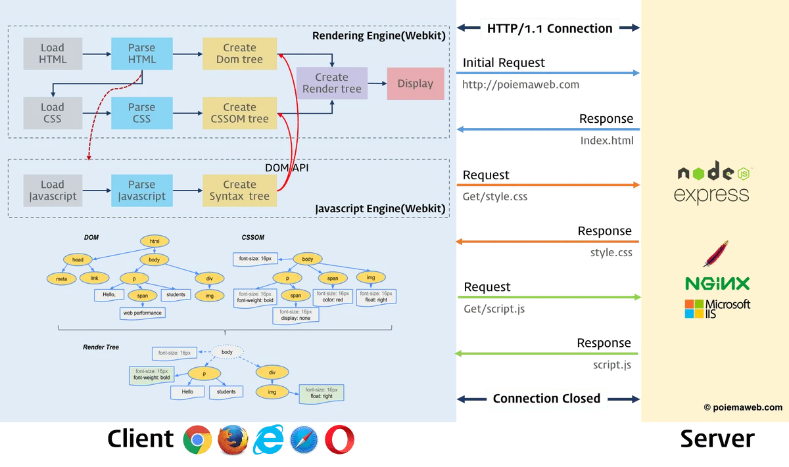
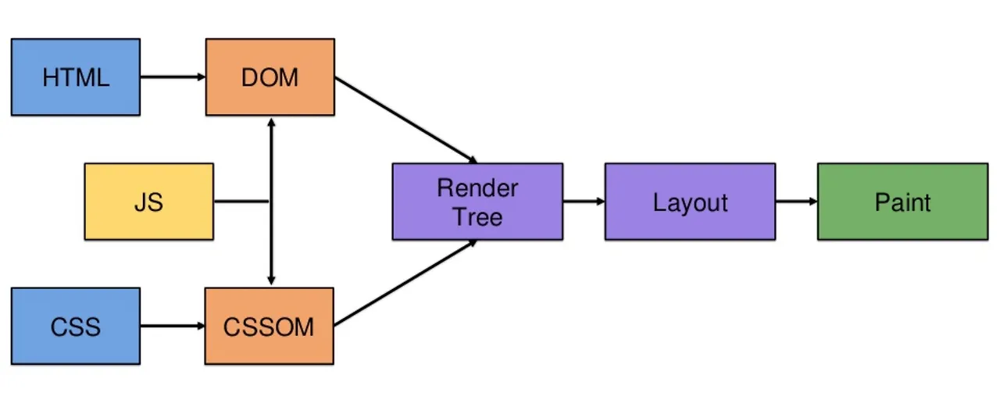
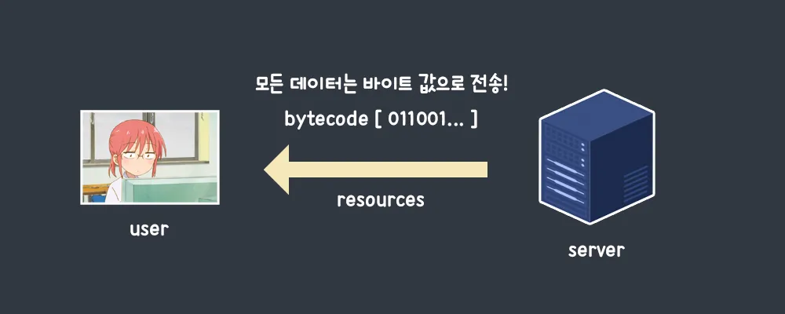
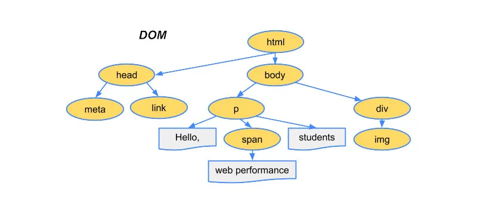
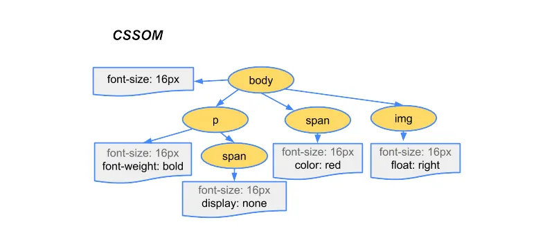
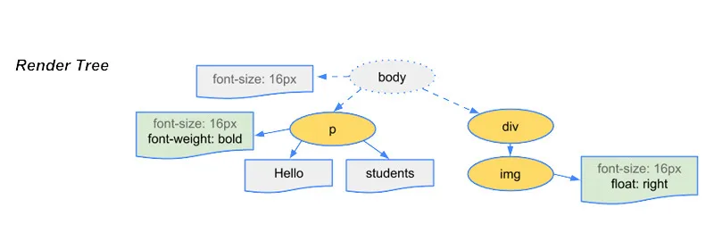
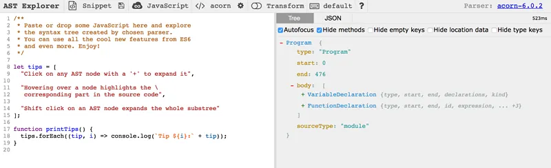

# 렌더링 과정을 아는 것이 중요한 이유

우리는 웹사이트에 접속할 때 단순히 주소창에 주소를 입력하거나, 링크가 걸린 텍스트를 누르기만 하면 됩니다. 하지만 반대로 웹 브라우저의 입장에서는 사용자가 원하는 화면을 보여주기 위해 내부적으로 많은 과정을 수행합니다. 서버로부터 웹 페이지와 관련된 리소스(HTML, CSS, JS)도 불러와야 하고, 이를 해석도 해야 하며, 어떤 것만 보여줄 지도 결정해야 합니다. 이러한 과정을 거치며 만들어진 결과물을 최종적으로 사용자에게 보여주게 되는데, 이 과정을 통틀어 `렌더링(Rendering)`이라 합니다.

렌더링을 하는 프로세스 자체는 간단하지만, 잦은 렌더링은 성능 저하를 일으킵니다. 그렇기 때문에 웹 브라우저의 렌더링 과정을 잘 이해하고 있으면, 렌더링 시 필요한 자원들에 대해 최적화를 해줌으로써 많은 성능 향상을 기대할 수 있습니다.

아래는 웹 브라우저의 렌더링 과정에서 발생하는 상황을 간략하게 표현한 그림입니다.

## TL;DR

- 렌더링에 필요한 리소스인 HTML, CSS, JS, IMAGE를 서버에 요청해 받아 옵니다.
- 렌더링 엔진은 HTML과 CSS를 파싱하여 토큰으로 분해하고, 각각 DOM과 CSSOM 트리를 생성하여 렌더 트리로 결합합니다.
- 자바스크립트 엔진에 의해 JavaScript가 파싱되고, AST를 생성하여 바이트코드로 변환 후 실행합니다. 이 과정에서 DOM을 조작하는 명령이 실행되면, 실행이 끝난 이후 다시 DOM과 CSSOM을 생성하여 렌더 트리로 결합합니다.
- 생성된 렌더 트리를 기반으로 요소들을 화면에 그려나갑니다.

> 파싱(Parsing)이란, 문법에 맞게 작성된 코드를 최소한의 문법적 의미를 가진 토큰(Token)으로 분해하고, 분해된 토큰을 토대로 파스 트리(Parse Tree)를 생성하는 일련의 과정을 말합니다. 일반적으로 파스 트리를 기반으로 중간 언어인 바이트 코드를 생성하고 실행합니다.

# Critical Rendering Path (CRP)

우리가 작성한 내용을 화면의 픽셀로 나타내는 렌더링 과정을` 주요 렌더링 경로(Critical Rendering Path, 줄여서 CRP)`라 부릅니다. 본문을 통해 렌더링 프로세스에서 발생하는 과정들을 하나씩 알아보도록 합시다.

## 1. 서버에 리소스 요청

웹 브라우저는 렌더링에 필요한 리소스를 서버에 요청합니다. 리소스에는 HTML, CSS, JS 파일은 기본이고 이미지나 폰트, 그리고 서버에서 동적으로 생성한 데이터까지 포함됩니다. 사용자는 주소창에 URL을 입력함으로써 서버에 요청을 보내게 되고, 결과로 HTML 문서를 응답 받습니다.

네트워크를 통해 오고 가는 데이터는 기본적으로 모두 0과 1로 이루어진 바이트코드(Bytecode) 문서입니다. 그렇기 때문에 응답 받은 HTML 문서는 텍스트로 변환하는 과정이 필요한데, 이는 서버가 문서를 보내줄 때 헤더를 통해 어떤 문자셋(UTF-8, EUC-KR 등)으로 변환해야 하는지 알려주므로 걱정하지 않아도 됩니다. HTML 문서가 텍스트로 변환된 후에는 렌더링 엔진이 코드를 위에서부터 아래로 읽어 나가며, 필요한 리소스를 추가로 요청합니다.

> `<link>` 태그를 만나면 CSS를 요청하고, `<script>` 태그를 만나면 자바스크립트를 요청합니다.

## 2. DOM 트리 생성

바이트에서 문자열로 변환 된 HTML 문서는 처음에는 순수한 텍스트 파일입니다. 그렇기 때문에 이를 시각적으로 표현하기 위해서는 웹 브라우저가 이해할 수 있는 자료구조로 만들어야 합니다. 가장 먼저 파싱을 통해 텍스트들을 문법적 의미를 갖는 최소 단위인 토큰(Token)으로 분해하고, 분해된 토큰들을 객체 노드로 변환합니다. 각 노드들은 서로 중첩 관계를 갖고 있으며, 이러한 관계를 토대로 트리 구조를 생성합니다.

이렇게 만들어진 트리를 `DOM(Document Object Model)`이라 합니다.

## 3. CSSOM 트리 생성

HTML을 파싱하는 도중 `<link>` 태그를 만나게 되면, 일시적으로 HTML 파싱을 중단합니다. 그리고 서버로부터 CSS를 받아 와 DOM을 생성할 때와 동일한 과정을 거치며, `CSSOM(CSS Object Model)`을 생성하기 시작합니다. 둘 간에 큰 차이는 없지만, CSSOM을 구성하는 노드들은 부모의 속성을 상속한다는 특징이 있습니다. 예를 들어 body 태그에 font-size 속성을 지정했다면, 하위 태그들의 노드에도 font-size 속성이 추가됩니다. 이런 특징이 CSS의 Cascading을 보여주는 대표적인 사례입니다.

## 4. 렌더 트리 생성

렌더링 엔진에 의해 만들어진 DOM과 CSSOM은 렌더링을 위해 서로 결합되며, 결합된 최종 구조를 `렌더 트리(Render Tree)`라 부릅니다. 렌더 트리에는 실질적으로 렌더링되지 않는 요소(head 요소, display: none이 적용된 요소)들은 포함되지 않습니다. 이렇게 완성된 렌더 트리는 화면에 보여 줄 HTML 요소들의 레이아웃(위치, 크기 등)을 계산하는데 사용됩니다.

## 5. 레이아웃 (Layout)

레이아웃(Layout)은 각 요소들간의 상대적인 위치와 크기 등의 스타일을 결정하는 과정입니다. 렌더 트리를 구성하는 모든 노드들은 자식 노드들의 레이아웃을 배치하며, 모든 자식 노드들의 레이아웃이 결정될 때까지 반복합니다. 그렇기 때문에 특정 부모 노드에게 레이아웃이 발생하면, 자식 노드들까지 레이아웃이 발생하므로 성능 저하에 많은 영향을 미칩니다.

브라우저 창의 사이즈를 변경하거나, 글꼴(font-family, font-size 등)처럼 하위 노드에도 영향을 주는 속성들이 레이아웃을 발생시킵니다.

## 6. 페인트 (Paint)

레이아웃을 통해 요소들의 위치와 스타일 계산을 마쳤다면, 이제는 요소들을 화면에 그릴 준비를 해야 합니다. 이 과정을 페인트라 하는데, 이 동안에는 렌더 트리를 순회하면서 레이어(Layer)라는 것을 만들고 레이어를 채우는 과정(배경, 텍스트, 순서 등)들을 기록합니다.

레이어가 존재하는 이유는 요소를 화면에 그리는 순서를 보장하기 위함입니다. 화면에 그릴 요소들에 z-index나 position 속성이 부여되어 있는데, 레이어가 없다면 그리는 순서가 일치하지 않아 잘못된 결과를 보일 수 있습니다.

## 7. 합성 (Composite)

레이아웃과 페인트 과정으로 이제는 화면에 그릴 요소들의 순서와 위치, 스타일 등을 모두 알고 있습니다. 이 정보를 픽셀로 변환하는 작업을 `래스터화(Rasterizing)`이라 하며, 합성 단계에서는 각 레이어를 래스터화하여 뷰포트(브라우저 화면)에 알맞게 합성합니다.

# 픽셀 파이프라인

렌더링은 다음 상황에 재차 일어날 수 있습니다.

- 자바스크립트에 의해 동적으로 노드를 추가하거나, 삭제하는 경우
- 웹 브라우저의 뷰포트(Viewport) 크기를 변경하는 경우
- HTML 요소의 레이아웃이 변경되는 스타일을 적용하는 경우 (margin, padding 등)

이렇게 화면이 업데이트됨에 따라 렌더링 과정이 다시 발생하는 것을 리렌더링(Re-rendering)이라 합니다. 이 때는 렌더 트리가 생성된 이후의 작업들만 다시 일어나는데, 주요 렌더링 경로(CRP)에서 알아본 것처럼 많은 성능 저하가 발생할 수 있는 부분입니다. 그렇기 때문에 가급적이면 리렌더링이 많이 발생하지 않도록, 최적화를 잘 해주는 것이 중요합니다.

화면을 업데이트하게 되면 DOM 요소를 조작하는 JavaScript, 그리고 어떤 스타일에 CSS 규칙을 적용할지 결정하는 Style 과정은 공통적으로 발생합니다. 하지만 Layout, Paint, Composite은 어떤 CSS 프로퍼티를 사용했냐에 따라 발생 여부가 결정됩니다. 따라서 Composite만 발생하는 경우가 가장 이상적인 상황이고, 다시 레이아웃을 계산하는 리플로우(reflow)와 요소를 다시 그리는 리페인트(repaint) 발생을 최소화해야 합니다.

> 리플로우, 리페인트, 합성이 발생하는 CSS 프로퍼티가 궁금한 분들은 [CSSTrigger](https://lab.skk.moe/css-triggers)에서 확인해 보세요.

# 자바스크립트가 파싱되고 실행되는 시점

DOM을 생성하는 중에 `<script>` 태그를 만나면, CSS 때와 동일하게 HTML 파싱을 일시적으로 중단합니다. 그리고 자바스크립트는 렌더링 엔진이 처리하는 것이 아니기에, 자바스크립트 엔진(크롬의 경우 V8 엔진)에게 제어권을 넘깁니다. 제어권을 받은 자바스크립트 엔진은 자바스크립트 코드를 파싱하여 `AST(추상적 구문 트리)`를 만들고, 컴퓨터가 이해할 수 있는 저수준 언어인 바이트코드로 변환합니다. 변환된 바이트코드는 인터프리터에 의해 실행됩니다.
AST는 그냥 이렇게 생긴 자료구조이며, 인터프리터나 컴파일러가 사용합니다.

> 본문의 주제는 렌더링 과정이기 때문에, 자바스크립트 엔진과 AST에 대해서는 자세하게 다루지 않습니다.

# 참고 자료

- [브라우저 동작 원리](https://poiemaweb.com/js-browser)
- [렌더링 성능](https://developers.google.com/web/fundamentals/performance/rendering/?hl=ko)
- [렌더링 트리 생성, 레이아웃 및 페인트](https://developers.google.com/web/fundamentals/performance/critical-rendering-path/render-tree-construction?hl=ko)
- [Abstact syntax trees on Javascript](https://jotadeveloper.medium.com/abstract-syntax-trees-on-javascript-534e33361fc7)
