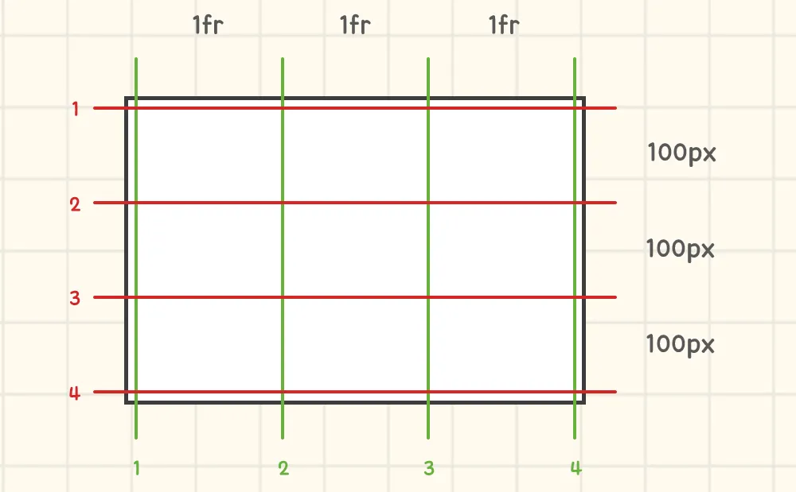
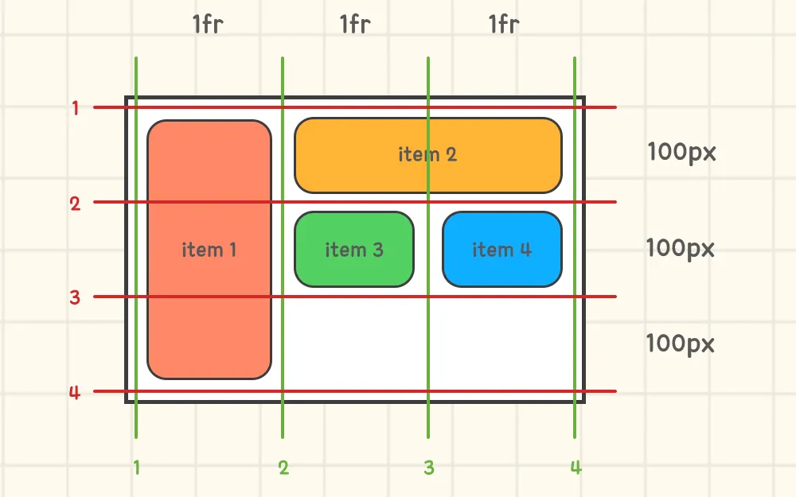

# 레이아웃을 만드는 또 다른 방법

요즘은 레이아웃을 만들 때, 주로 flex 속성을 사용합니다. 하지만 flex를 사용하면서 종종 아쉬운 상황들이 몇 가지 발생하는데, 기본적으로 flex는 1차원에 대한 레이아웃 시스템이기 때문입니다. 특히 정렬과 관련해 의도한 대로 동작하지 않아 억지로 맞추는 경우(CSS Trick)를 들 수 있습니다. 이런 상황에서 우리는 `grid`를 고려해볼 수 있습니다. grid는 기본적으로 가로/세로 2차원에 대한 레이아웃 시스템이며, 복합적인 레이아웃 구조를 만들 때 flex보다 유용합니다.


> Grid Box와 달리 Flex Box는 요소들을 1차원적으로 정렬하는 컨테이너입니다.

# Grid 시작하기

그리드도 플렉스와 동일하게 display 속성이 적용된 요소를 `컨테이너(Container)`라 하며, 내부에 들어있는 요소들을 `아이템(Item)`이라 합니다. 그리드를 사용해 요소를 배치하려면 가장 먼저 컨테이너에 그리드 영역을 만들고, 아이템들을 영역에 하나씩 배치하면 됩니다.

## 그리드 영역 만들기

그리드 영역은 `grid-template-columns`과 `grid-tempalte-rows` 프로퍼티로 만들 수 있습니다.

```css
.container {
  display: grid;

  /* grid-template-columns: 1fr 1fr 1fr; */
  grid-template-columns: repeat(3, 1fr);

  /* grid-template-rows: 100px 100px 100px; */
  grid-template-rows: repeat(3, 100px);
}
```

각각 열과 행에 대해 영역을 만드는 속성이며, 원하는 만큼 다양한 단위를 사용해서 만들 수 있습니다. 저는 같은 값을 이용해서 영역을 여러 개 만들고자 했기 때문에, CSS에서 기본적으로 제공하고 있는 `repeat(반복 횟수, 단위)` 함수를 사용했습니다. 이렇게 하면 다음과 같이 영역이 구분됩니다.



영역을 만들게 되면 화면에는 보이지 않지만 좌우에 격자가 생겨 영역을 구분할 수 있습니다. 이 격자를 `그리드 라인(Grid Line)`이라 부르는데, 이를 통해 각각의 아이템들이 자신을 어느 위치에 둘 지 정할 수 있습니다. 그리고 여기에 사용된 `fr(fraction)`은 유연한 크기를 갖는 단위이며, 남은 공간을 fr만큼 나눠 차지할 수 있습니다.

이렇게 나눈 영역에는 `grid-template-areas` 프로퍼티를 통해, 각 영역에 배치될 아이템을 정할 수 있습니다.

```css
.container {
  display: grid;
  grid-template-columns: repeat(3, 1fr);
  grid-template-rows: repeat(3, 100px);
  grid-template-areas:
    'header header .'
    'main main aside'
    'footer footer footer';
  /* 요소끼리 얼마나 떨어지게 할 것인지 */
  gap: 10px;
}

header {
  grid-area: header;
}

main {
  grid-area: main;
}

aside {
  grid-area: aside;
}

footer {
  grid-area: footer;
}
```

선택자 대신 `.`이나 `none`을 적게 되면, 해당 영역은 비워 둘 수 있습니다.

이렇게 만든 그리드 레이아웃의 결과물을 웹 브라우저의 개발자 도구에서 보면 다음과 같습니다.


그리고 아이템 사이에 간격을 두고 싶으면 `gap` 속성을 사용할 수 있는데, 이는 `row-gap`과 `column-gap`이 하나로 합쳐진 속성입니다. 값을 하나만 적으면 행과 열에 모두 적용되는데, 만약 행과 열의 간격을 각각 다르게 적용하고 싶다면 `gap: row-gap column-gap`의 형태로 사용하면 됩니다.

또한 지금까지 만든 영역은 `grid-template` 속성 하나로 묶어 사용할 수 있습니다.

```css
.container {
  display: grid;
  grid-template:
    'header header .' 100px
    'main main aside' 100px
    'footer footer footer' 100px
    / 1fr 1fr 1fr;
  gap: 10px;
}
```

각 행마다 아이템이 차지할 영역과 크기를 적고, 마지막에 /로 구분한 다음, 열이 되는 영역의 크기를 지정하면 됩니다.

> 배치되지 않은 요소를 자동으로 배치해주는 grid-auto-\_ 속성도 있지만, 본문에서는 다루지 않습니다.

## 아이템 정렬하기

그리드 컨테이너 내부에 있는 아이템들을 정렬하는 방법은 flex와 동일하게 `justify-content`, `align-items`를 사용할 수 있습니다. 그리고 그리드는 요소들을 2차원적으로 관리하기 때문에, `justify-items`, `align-content` 속성도 사용할 수 있고 저마다 결과 모습이 다릅니다. 기본값은 normal(=stretch와 같은 효과)이기 때문에, 테스트하고자 한다면 컨테이너의 크기를 아이템들의 합보다 크게 만들어 줘야 합니다.

또한 그리드는 `justify-`와 `align-`을 합쳐 사용할 수 있는 `place-` 속성이 있습니다. header와 main이 있는 위 그림에서 텍스트가 요소 정중앙에 배치된 걸 보실 수 있는데, 여기서 `place-items` 속성을 사용했습니다.

```css
.container > _ {
  display: grid;
  /* place-items: align-items justify-items; */
  /* place-content: align-content justify-content; */
  place-items: center;
}
```

## 아이템 개별 배치

아이템 배치 역시 flex와 동일하게 `order`, `align-self`, `justify-self` 등의 속성을 사용할 수 있습니다. 그래서 본문에서는 이보다는 그리드에서만 볼 수 있는 아이템 배치 속성을 소개하려 합니다. 위에서 잠깐 언급했던 그리드 라인이 바로 여기서 사용됩니다. 그럼 총 4개의 아이템을 만들어 그리드 안에 자유롭게 배치해 보겠습니다.

```css
.item:nth-child(1) {
  /* 
    grid-row-start: 1;
    grid-row-end: 4;
    end를 생략하면 1칸 
  */
  grid-row: 1 / 4;
}

.item:nth-child(2) {
  /* 
    grid-column-start: 2;
    grid-column-end: 4;
    end를 생략하면 1칸 
  */
  grid-column: 2 / 4;
}
```

두 속성의 사용 방법은 크게 어렵지 않습니다. 그저 아이템이 그리드 라인의 몇 번부터 몇 번까지의 영역을 차지할 것인지만 슬래시로 구분하면 됩니다. 이렇게 속성을 부여하게 되면, 아이템들이 그리드 내에 다음과 같이 배치됩니다.



위 방법 말고도 얼마 만큼의 영역을 사용할 것인지 span을 통해 직접 명시할 수도 있습니다.

다음의 코드는 위 코드와 동일한 결과를 보입니다.

```css
.item:nth-child(1) {
  grid-row: span 3;
}

.item:nth-child(2) {
  grid-column: 2 / span 2;
}
```

`start / span n` 형태로 사용하면 start 라인부터 n개의 영역을 사용한다는 의미이고, start를 생략하고 `span n`만 쓴다면 맨 앞에서부터 n개의 영역을 사용한다 생각하면 됩니다.

# 참고 자료

- [CSS Grid 완벽 가이드](https://heropy.blog/2019/08/17/css-grid/)
- [이번에야말로 CSS Grid를 익혀보자](https://studiomeal.com/archives/533)
- [Grid - CSS: Cascading Style Sheets](https://developer.mozilla.org/ko/docs/Web/CSS/grid)
